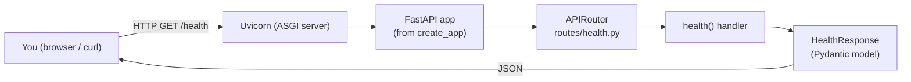
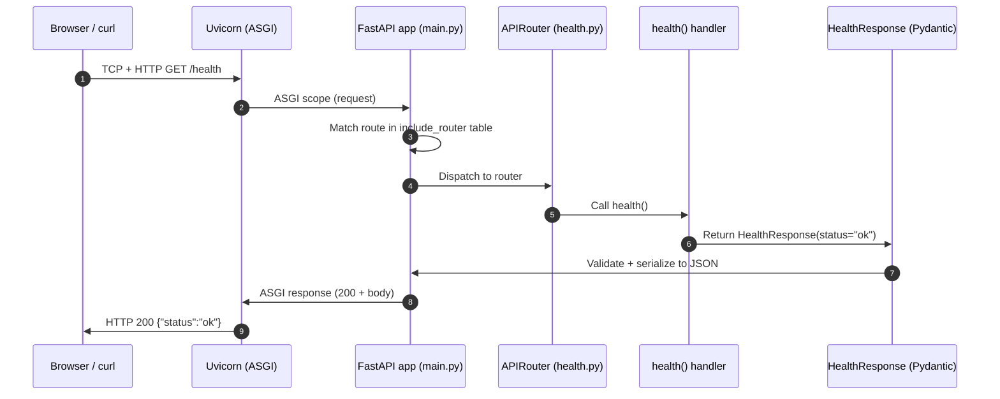
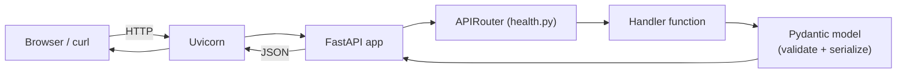
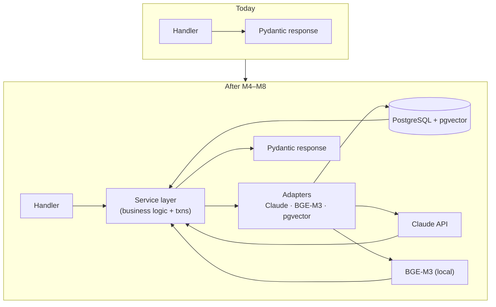

# FlowForge AI — Developer Journal

> **What this is.** Your personal, revision-oriented reference for FlowForge AI. Read top-to-bottom in ~15 minutes to fully swap the project's current state back into your head. **Update after every milestone; don't rewrite.** Each section is short on purpose — depth lives in `docs/ADR.md` and `docs/SystemDesign.md`.
>
> **Last updated:** end of Milestone 0.4 · **Owner:** you.

---

## 1. Current Project Overview

**What FlowForge AI is.** A web app that ingests a **requirements document** and a **Python repository** and reasons about each requirement the way an experienced engineer would. Its flagship output is an explainable **Requirement Traceability Matrix**: for every requirement — implemented / partial / missing, tested or not, with cited code as evidence, a confidence band, and its supporting signals.

**The problem it solves.** Requirements live in documents, code lives in repos, and keeping them aligned is manual, slow, and error-prone. AI code-review tools see the code but not the intent; requirements tools see the intent but not the code. Nothing links the two for a normal software team. FlowForge is that link.

**The final vision (post-MVP).** A seven-stage per-requirement reasoning pipeline: **Understand → Requirement Intelligence → Engineering Expectations → Traceability → Engineering Risk → Business Impact → Executive Insights** — turning "did we build what we said we'd build?" into a decision-support platform for engineering managers.

**What our MVP currently includes (scope, not code).**
- Requirement Extraction + ambiguity flagging (Stages 1–2).
- Engineering Expectations that sharpen retrieval (Stage 3).
- Requirement Traceability judged **per expectation** — the flagship.
- Deterministic Engineering Risk, Business Impact (six dimensions, no compliance/audit), and a five-dimension Requirement Intelligence Score.
- Executive rollup with one narrative call.
- Evaluation harness over the flagship (retrieval recall@k, verdict precision/recall, confidence separation).
- Python repos only. Single-user. No auth.

### Things you should remember
- FlowForge = requirements ⇄ code, **explainable**, evidence-cited, confidence-banded.
- Flagship = **per-expectation traceability**, not just per-requirement.
- Reasoning boundary: **Claude reasons, deterministic code does everything else.**
- Advisory vs factual outputs are honestly distinguished (this protects trust).
- MVP is Python-only, single-user; compliance/audit and contradiction detection deferred.

---

## 2. Current Architecture

Today the backend is a minimal, single-process FastAPI app. Everything the frozen design promises is wired later — right now we have the **frame**, not the layers.



**Why we started here.** *Walking skeleton.* Get an end-to-end path that runs before adding any real logic, so every later milestone plugs into a working system rather than an unproven one. The composition root (`create_app()`) already exists, so future concerns (config, DB, middleware, more routers) have exactly one obvious home.

### Things you should remember
- One process, one endpoint (`/health`), zero external dependencies today.
- **Composition root:** `create_app()` is where the app is assembled. Everything future wires into this factory.
- Walking skeleton = end-to-end thin slice first, depth later.
- The frame is set; the layers (services, adapters, domain) arrive in later milestones.

---

## 3. What We Have Built So Far

### M0.1 — Repository Skeleton *(done)*
- **Objective.** Establish the monorepo shape and hygiene contracts.
- **Built.** Root `README.md`, `.gitignore`, `.env.example`, empty `backend/`, `frontend/`, `docs/` with the frozen ADR + System Design copied in.
- **Why necessary.** Structure encodes design. Getting secrets discipline, docs-as-code, and the backend/frontend split right on day one costs nothing; retrofitting later is painful.
- **Learned.** Docs-as-code (architecture travels with code), `.env` vs `.env.example` (shape ≠ secrets), the `!.env.example` re-inclusion trick, why `uv.lock` is *not* ignored.

### M0.2 — Backend Skeleton & Tooling *(done)*
- **Objective.** Make the project actually *run* — a FastAPI app serving `/health`, wired to a professional Python toolchain.
- **Built.** `pyproject.toml` (uv-managed, deps + tool config), `.python-version`, `uv.lock`, package tree under `app/`, `create_app()` factory, `/health` route with a Pydantic response model, first passing test.
- **Why necessary.** First runnable checkpoint. The **application-factory** pattern and **Pydantic-contract** habit start here — set the bar on the trivial endpoint so every future one inherits it.
- **Learned.** Application factory vs module global, contract-first APIs, liveness vs readiness (kept deliberately separate), why lockfiles are committed, why `mypy --strict` from day one is cheaper than adding it later.

### M0.3 — Configuration & Structured Logging *(done)*
- **Objective.** Give the app typed, env-driven config and one-line JSON logging.
- **Built.** `app/core/config.py` (`Settings` via pydantic-settings), `app/core/logging.py` (JSON formatter + `configure_logging`), factory now builds settings + configures logging and stores settings on `app.state`. Added `tests/conftest.py` fixtures.
- **Why necessary.** Everything from 0.4 on needs config; logging is cheapest to standardize while small. Establishes the DI pattern (settings injected, not `os.environ` scattered).
- **Learned.** pydantic-settings, structured logging, `lru_cache` singletons, why config is injected through the factory.

### M0.4 — Docker, PostgreSQL, pgvector & Readiness *(done)*
- **Objective.** One `docker compose up` → FastAPI + Postgres 16 (pgvector) + DB-checking `/health/ready`.
- **Built.** `app/core/db.py` (async engine, session factory, `get_db_session` dependency), lifespan handler in `main.py` (engine created on boot, disposed on shutdown), `/health/ready` route, `backend/Dockerfile` (multi-stage), `docker-compose.yml`, `docker/postgres/init/01-extensions.sql`, `.dockerignore`, readiness tests.
- **Why necessary.** Environment parity (dev == prod DB) and the DB connection every feature depends on. Async engine now avoids a sync→async migration later.
- **Learned.** Async SQLAlchemy 2.x, psycopg3 async driver, FastAPI lifespan, DB session as a DI dependency, multi-stage Docker builds, compose healthchecks + `depends_on: condition: service_healthy`, liveness vs readiness in practice.

### Things you should remember
- Four milestones done → **one repo, a Dockerized FastAPI + Postgres/pgvector stack, `/health` + `/health/ready`, clean quality gates.**
- Every decision was ADR/SystemDesign-conformant (nothing off-piste).
- `httpx` → `httpx2` swap in 0.2 was the only implementation-level deviation; documented and warning-clear.
- If you can't answer "why does this file exist?" in one sentence, re-read §5.

---

## 4. Current Folder Structure

```
flowforge/
├── .gitignore                       # hygiene: venvs, caches, secrets, node_modules
├── .env.example                     # config template (names only, no secrets)
├── README.md                        # onboarding + milestone checklist
├── backend/                         # FastAPI service — grows every milestone
│   ├── .python-version              # pins Python 3.12
│   ├── pyproject.toml               # manifest: deps + tool config
│   ├── uv.lock                      # exact resolved deps (COMMITTED)
│   ├── README.md                    # backend map
│   ├── app/                         # importable application package
│   │   ├── __init__.py
│   │   ├── main.py                  # composition root: create_app() + `app`
│   │   └── api/                     # HTTP layer
│   │       ├── __init__.py
│   │       └── routes/              # one file per resource
│   │           ├── __init__.py
│   │           └── health.py        # /health liveness
│   └── tests/                       # pytest suite (parallel to app/)
│       ├── __init__.py
│       └── test_health.py
├── frontend/                        # Next.js stub — grows from M0.6 / M10
│   └── README.md
└── docs/                            # frozen architecture contract
    ├── ADR.md
    └── SystemDesign.md
```

**Purpose of each folder.**
- **`backend/`** — the FastAPI service. Everything Python lives here.
- **`backend/app/`** — the *importable* application (`import app...`). All shipped code goes under here.
- **`backend/app/api/`** — HTTP concerns only (routes today; later: `deps.py` for shared dependencies).
- **`backend/app/api/routes/`** — one file per resource (`health.py`; later `projects.py`, `analyses.py`, `eval.py`).
- **`backend/tests/`** — parallel to `app/`. Kept outside `app/` so tests don't ship in a production image.
- **`frontend/`** — Next.js UI. Stub today; comes alive in M0.6/M10.
- **`docs/`** — the frozen ADR + System Design. Docs-as-code — architecture travels with the source.

**Folders coming in later milestones** (know these are planned so you're not surprised):
`app/core/` (config, db, logging), `app/services/`, `app/domain/` (models + schemas), `app/adapters/` (llm, embeddings, vectorstore), `app/prompts/`, `app/eval/`, and `migrations/` for Alembic.

### Things you should remember
- **Tests parallel to app**, never inside it.
- One file per resource in `routes/`.
- `docs/` is versioned alongside code — no drift.
- The current tree is the frame; later layers all have pre-designated homes in `app/`.

---

## 5. File-by-File Explanation

Ordered by tier (project-definition → structure → application → tests). Practical answers to "why does this exist?"

### Project-definition tier

**`backend/pyproject.toml`** — The manifest. Runtime deps, dev deps, and *all* tool config (ruff, mypy, pytest) in one file. Tools locate it by walking up from the CWD — its location defines the project root. Used by `uv`, `pytest`, `ruff`, `mypy`. **Grows every milestone** as new dependencies land.

**`backend/.python-version`** — Pins interpreter to 3.12 so you, uv, Docker, and CI all use the same Python. `pyproject.toml`'s `requires-python` is a *floor* (compatibility contract); this file is the *exact* one used. Bumped deliberately as a reviewed change.

**`backend/uv.lock`** — The exact resolved version + hash of every dependency (including transitives). Generated by `uv`, installed by `uv sync`. **Committed** — this is what makes installs deterministic on your machine, in Docker (0.4), and in CI (0.5). Mental model: pyproject = shopping list, uv.lock = receipt.

### Structure tier

**`backend/app/__init__.py`, `backend/app/api/__init__.py`, `backend/app/api/routes/__init__.py`, `backend/tests/__init__.py`** — Package markers. Turn folders into importable packages so `from app.api.routes import health` works predictably. Empty today (just a docstring). Some will graduate later to expose clean package APIs (e.g., `adapters/llm/__init__.py` re-exporting `ClaudeClient`). Their placement encodes the layer boundaries.

### Application tier

**`backend/app/main.py`** — **The composition root.** Contains `create_app()` (builds and configures the FastAPI app) and the module-level `app = create_app()` uvicorn imports as `app.main:app`. Right now it only includes the health router. **This is the most-edited file going forward** — 0.3 injects `Settings`, 0.4 adds DB lifespan + middleware + exception handlers, every new router is registered here. The factory pattern is what makes tests able to build isolated app instances.

**`backend/app/api/routes/health.py`** — `/health` liveness endpoint + its Pydantic response contract `HealthResponse`. Exposes an `APIRouter` that `main.py` includes. **Zero downstream dependencies on purpose** — a liveness probe must never fail because the DB is having a moment. Sets the **template every future route file will copy**: `APIRouter` + Pydantic `response_model` + a fully typed handler. In 0.4 we'll add `/health/ready` alongside it (which *does* check the DB).

### Test tier

**`backend/tests/test_health.py`** — Executable specification: `/health` returns 200 with `{"status": "ok"}`. Uses FastAPI's `TestClient` to drive the ASGI app in-process (no network, no live server). It imports `create_app` — this is where the factory pattern pays off concretely, because it lets the test build an isolated app instance. **The first thread of your regression net.** Every future feature adds tests here; in M11 the eval harness is a separate specialized effort on top.

### Repository-level (already covered in journal §4 but part of the file map)

**`.gitignore`** — hygiene contract. Note the `!.env.example` re-inclusion. **`.env.example`** — config surface (names, not values). **`README.md`** — onboarding + live M0 checklist. **`docs/ADR.md`, `docs/SystemDesign.md`** — the frozen contract. **`backend/README.md`, `frontend/README.md`** — placeholders so git tracks the directories + documents each context.

### Things you should remember
- **`main.py` is the composition root** — every future concern wires into `create_app()`.
- **`health.py` is the template** — every future route file follows its shape.
- **`test_health.py` proves the factory pays off** — isolated app in-process, fast.
- Package markers are structural, not behavioral — they encode the layer boundary.
- `pyproject.toml` grows every milestone; `uv.lock` is committed for determinism.

---

## 6. Request Lifecycle — `GET /health`

What happens from your keystroke to the JSON on screen:



**Which file runs when:**
1. **Startup (once):** `python -m uvicorn app.main:app` imports `app/main.py` → runs `create_app()` → `include_router(health.router)` registers `/health` in the routing table. Now uvicorn is listening.
2. **Request-time (per call):** `GET /health` arrives → uvicorn hands the ASGI scope to the FastAPI `app` → FastAPI matches `/health` and calls `health()` in `routes/health.py` → the handler returns `HealthResponse(status="ok")` → FastAPI validates it against the `response_model`, serializes to JSON, sends 200 back through uvicorn to you.

**The one non-obvious point:** the Pydantic `response_model` runs *even on the way out*. It validates that the handler returned data matching the contract. If a future refactor accidentally returns `{"stauts": "ok"}` (typo), FastAPI will reject the response — the contract catches bugs on both sides of the wire.

### Things you should remember
- Startup wiring runs **once**; the handler runs **per request**.
- `include_router` is what makes routes discoverable — no magic.
- `response_model` validates on the way out, not just on the way in.
- `TestClient` walks this exact same path in-process — that's why tests are fast and realistic.

---

## 7. Engineering Concepts Learned

Concepts *introduced so far*, in the order you met them.

**`pyproject.toml`** — The modern Python project manifest (PEP 621). Replaces `setup.py` + `setup.cfg`. Holds metadata, deps, and tool config. *Here:* backend root; used by uv/pytest/ruff/mypy.

**`uv`** — Very fast, Rust-based Python package manager and environment manager. Replaces pip + virtualenv + (sometimes) Poetry. *Here:* `uv sync` builds the venv from `pyproject.toml` + `uv.lock`; `uv run <cmd>` runs commands inside it without activating the venv.

**`uv.lock`** — Pinned, hashed record of the exact dependency tree. *Here:* committed in `backend/`, ensures your machine, Docker, and CI install identical versions.

**`__init__.py`** — Marks a folder as an importable Python package. *Here:* one per package folder in `app/` and `tests/`. Enables dotted imports like `app.api.routes.health`.

**FastAPI** — Modern async Python web framework. Uses type hints for validation, docs, and dependency injection. *Here:* the whole HTTP layer.

**Uvicorn** — The ASGI server that actually speaks HTTP and hands requests to FastAPI. FastAPI is the *framework*; uvicorn is the *runner*. *Here:* `uv run uvicorn app.main:app --reload`.

**Pydantic** — Data validation library using type hints. Turns Python classes into runtime-validated schemas + JSON serializers. *Here:* `HealthResponse` in `health.py`. Every future request/response contract, and later our `Settings`, uses it.

**`APIRouter`** — A mini-FastAPI you attach routes to, then include into the app. Lets you split routes across files without a giant `main.py`. *Here:* `router` in `health.py`, included into the app in `main.py`. Every new resource gets its own router.

**`create_app()` — Application-Factory pattern** — A function that *builds* the app rather than defining it at module level. Enables per-test isolation, cleaner DI, and explicit construction. *Here:* `app/main.py`. Every future wiring step edits this function.

**Composition Root** — The single place in a program where the dependency graph is assembled. *Here:* `create_app()`. Later, config, DB sessions, adapters, and services will all be composed here — never scattered across imports.

**pytest** — The de-facto Python test framework. Auto-discovers `test_*.py` files, runs assertions, gives short readable failures. *Here:* `tests/test_health.py`; runs via `uv run pytest`.

**Swagger / OpenAPI** — OpenAPI is the *spec* (a JSON schema describing your API); Swagger UI is a *renderer* that turns that spec into an interactive doc page. FastAPI generates the spec from your routes + Pydantic models automatically. *Here:* visit `/docs` when the server is running.

**ruff · mypy · strict typing** — ruff = fast lint + format + import-sort in one tool. mypy in strict mode enforces type hints throughout. *Here:* configured in `pyproject.toml`; run via `uv run ruff check .`, `uv run mypy app tests`.

**Liveness vs readiness** — Ops semantics. *Liveness*: "process alive?" (no deps). *Readiness*: "can it serve traffic?" (deps healthy). *Here:* `/health` is liveness; `/health/ready` runs `SELECT 1` and returns 503 if the DB is down.

**pydantic-settings** — Pydantic subclass that loads + validates config from env vars / `.env`. Misconfiguration fails fast at startup. *Here:* `app/core/config.py` (`Settings`).

**Structured (JSON) logging** — one log line == one JSON object, so logs are machine-parseable (crucial once we log token/cost per LLM call). *Here:* `app/core/logging.py`.

**SQLAlchemy 2.x (async) + psycopg3** — the ORM/engine layer; async so DB I/O doesn't block the event loop. `postgresql+psycopg://` selects the psycopg3 driver in async mode. *Here:* `app/core/db.py`.

**FastAPI lifespan** — async startup/shutdown hook. *Here:* creates the DB engine on boot, disposes it on shutdown; stores engine + session factory on `app.state`.

**Dependency injection (DB session)** — `get_db_session` yields a per-request `AsyncSession` via `Depends`; overridable in tests. Same pattern as settings, and the pattern adapters will use. *Here:* `app/core/db.py` + `Annotated[AsyncSession, Depends(...)]` in routes.

**Multi-stage Docker build** — a "builder" stage installs deps into a venv; a slim "runtime" stage copies just the venv + app and runs as non-root. Smaller, safer images. *Here:* `backend/Dockerfile`.

**Docker Compose + pgvector** — orchestrates backend + `pgvector/pgvector:pg16`; `depends_on: service_healthy` waits for the DB healthcheck before starting the backend. *Here:* `docker-compose.yml`.

### Things you should remember
- **FastAPI ≠ Uvicorn** — framework vs. server. You need both.
- **Pydantic is the contract layer** — used for requests, responses, *and* settings.
- **Factory + composition root** are why the app stays testable as it grows.
- **`uv.lock` is committed** — that's what "reproducible" means in practice.
- **OpenAPI is free** because you used type hints and Pydantic.
- **Liveness has no dependencies**, ever. Don't blur it with readiness.
- **The DB session is a dependency**, created once (engine) at lifespan, yielded per-request.
- **Async top to bottom** — async engine + async routes so long analyses never block.

---

## 8. Current Data Flow

Today the "data" is a two-field JSON object. The flow is trivial on purpose — the *shape* is what matters.



### How this evolves

Same skeleton; new stages plug in **between the handler and the response**. The Pydantic-contract habit and the composition root are what let each new stage slot in without redesign.



Key evolutions to expect:
- **0.3:** `Settings` injected through the factory — every future component reads config, not `os.environ`.
- **0.4:** DB session lifecycle in the app; `/health/ready` actually checks it. Data starts flowing into Postgres.
- **M4–M7:** long-running analysis moves off the request path (background task); the request flow stays synchronous but only *kicks off* work and later *fetches* results. This is the ADR-013 async execution model.
- **M5+ (Claude):** the service layer calls the `LLMClient` adapter — structured outputs, prompt caching, retries. The handler never talks to Claude directly.

### Things you should remember
- The **shape** of the flow (Browser → Server → Router → Handler → Pydantic → JSON) never changes.
- **New concerns plug in between handler and response** via the service layer, not the route.
- Long-running work goes **async via background tasks**, never inline in the request (ADR-013).
- The **adapters** are the only place external systems (Claude, embeddings, vectors) are touched.

---

## 9. What Comes Next

**Next milestone: 0.5 — CI Pipeline (GitHub Actions).**

**Why now.** The infra is in place and runnable; before adding real feature code we lock the quality gates into CI so every push is automatically linted, type-checked, and tested. Cheap to add now, protects everything after.

**How it builds on today.** CI simply runs the same commands you already run locally (`uv sync`, `ruff`, `mypy`, `pytest`) on GitHub's runners. Optionally builds the Docker image to catch build breaks.

**Files introduced (planned):** `.github/workflows/ci.yml`. No app code changes.

**After 0.5:** 0.6 (frontend stub) closes out Milestone 0. Then **M1** — the first real domain work — creates the database schema and Alembic migrations (including `CREATE EXTENSION vector` and the `code_unit.dense_embedding` pgvector column).

### How 0.4 prepares us for the AI phase
This milestone is the runway for everything AI:
- **Repository parsing (M3):** parsed `CodeUnit`/`TestUnit` rows need somewhere to live — the async DB session + engine we just built is that path.
- **Embeddings + pgvector (M4):** the pgvector-enabled Postgres is already running; M1 adds the `vector` column and index, and the embedder writes through the same session dependency.
- **Retrieval (M4):** hybrid search runs as SQL against pgvector — no new datastore, just queries through the session.
- **Claude integration (M5):** the `LLMClient` adapter will be injected exactly like `get_db_session` is today (same DI seam), and its token/cost logs use the JSON logger from 0.3.

In short: **the session dependency, the DI pattern, the JSON logger, and the pgvector container are the four hooks the AI pipeline hangs on.**

### Things you should remember
- 0.5 = **CI only** (run existing gates on GitHub); no app code.
- Real schema + migrations start in **M1**, including enabling pgvector in a migration.
- The AI pipeline reuses today's seams: **DB session dependency, DI pattern, JSON logger, pgvector container** — no re-architecture.
- `app/core/` is the cross-cutting infra bucket (config, logging, db) and will also host error handling later.

---

## 10. How to use this journal

- After every milestone, **append** to §3, refresh §4/§5 for any new files, **add** to §7 if a new concept was introduced, and rewrite §9 to point at the next one. Everything else usually only needs a light touch.
- Before a break of more than a week: read the *"Things you should remember"* bullets top-to-bottom. That should be enough to swap the project back in in under 5 minutes.
- Before interviews or reviews: read this in full (~15 min), then skim `docs/ADR.md` for the decisions and their rejected alternatives.

**Golden rule:** if you can't answer *"why does this exist?"* for any file in §5 in one sentence, re-read the ADR entry it implements before touching it.
