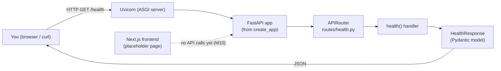
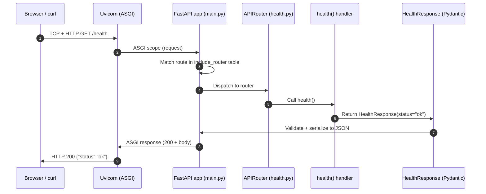
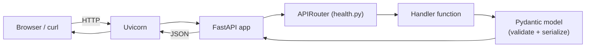
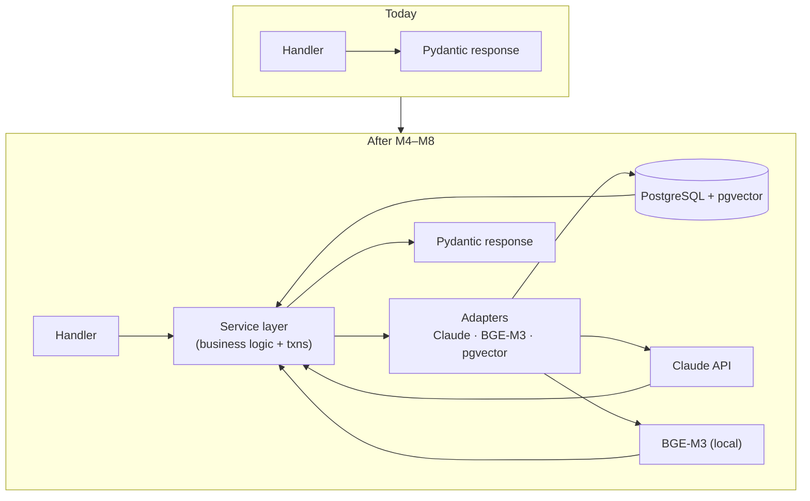

# FlowForge AI — Developer Journal

> **What this is.** Your personal, revision-oriented reference for FlowForge AI. Read top-to-bottom in ~15 minutes to fully swap the project's current state back into your head. **Update after every milestone; don't rewrite.** Each section is short on purpose — depth lives in `docs/ADR.md` and `docs/SystemDesign.md`.
>
> **Last updated:** M2 (Repository Intelligence Engine) design frozen — implementation not started · **Owner:** you.

---

## 1. Current Project Overview

**What FlowForge AI is.** A web app that ingests a **requirements document** and a **Python repository** and reasons about each requirement the way an experienced engineer would. Its flagship output is an explainable **Requirement Traceability Matrix**: for every requirement — implemented / partial / missing, tested or not, with cited code as evidence, a confidence band, and its supporting signals.

**The problem it solves.** Requirements live in documents, code lives in repos, and keeping them aligned is manual, slow, and error-prone. AI code-review tools see the code but not the intent; requirements tools see the intent but not the code. Nothing links the two for a normal software team. FlowForge is that link.

**The final vision (post-MVP).** A seven-stage per-requirement reasoning pipeline: **Understand → Requirement Intelligence → Engineering Expectations → Traceability → Engineering Risk → Business Impact → Executive Insights** — turning "did we build what we said we'd build?" into a decision-support platform for engineering managers.

**What our MVP currently includes (scope, not code).**
- Requirement Extraction + ambiguity flagging (Stages 1–2).
- Engineering Expectations that sharpen retrieval (Stage 3).
- Requirement Traceability judged **per expectation** — the flagship.
- Deterministic Engineering Risk, Business Impact (six dimensions, no compliance/audit), and a five-dimension Requirement Intelligence Score.
- Executive rollup with one narrative call.
- Evaluation harness over the flagship (retrieval recall@k, verdict precision/recall, confidence separation).
- Python repos only. Single-user. No auth.

### Things you should remember
- FlowForge = requirements ⇄ code, **explainable**, evidence-cited, confidence-banded.
- Flagship = **per-expectation traceability**, not just per-requirement.
- Reasoning boundary: **Claude reasons, deterministic code does everything else.**
- Advisory vs factual outputs are honestly distinguished (this protects trust).
- MVP is Python-only, single-user; compliance/audit and contradiction detection deferred.

---

## 2. Current Architecture

Today the backend is a minimal, single-process FastAPI app, and the frontend is a standalone Next.js skeleton that does not yet talk to it. Everything the frozen design promises is wired later — right now we have the **frame**, not the layers.



**Why we started here.** *Walking skeleton.* Get an end-to-end path that runs before adding any real logic, so every later milestone plugs into a working system rather than an unproven one. The composition root (`create_app()`) already exists, so future concerns (config, DB, middleware, more routers) have exactly one obvious home. The frontend is deliberately decoupled: it builds and runs on its own so M10 adds a single integration layer to a known-good base.

### Things you should remember
- Backend: one process, two endpoints (`/health`, `/health/ready`), Postgres/pgvector behind readiness.
- Frontend: independent Next.js skeleton, **no backend calls yet** — the boundary (frontend ↔ REST only, no secrets client-side) is permanent (§13, ADR-018).
- **Composition root:** `create_app()` is where the app is assembled. Everything future wires into this factory.
- Walking skeleton = end-to-end thin slice first, depth later.
- The frame is set; the layers (services, adapters, domain) arrive in later milestones.

---

## 3. What We Have Built So Far

### M0.1 — Repository Skeleton *(done)*
- **Objective.** Establish the monorepo shape and hygiene contracts.
- **Built.** Root `README.md`, `.gitignore`, `.env.example`, empty `backend/`, `frontend/`, `docs/` with the frozen ADR + System Design copied in.
- **Why necessary.** Structure encodes design. Getting secrets discipline, docs-as-code, and the backend/frontend split right on day one costs nothing; retrofitting later is painful.
- **Learned.** Docs-as-code (architecture travels with code), `.env` vs `.env.example` (shape ≠ secrets), the `!.env.example` re-inclusion trick, why `uv.lock` is *not* ignored.

### M0.2 — Backend Skeleton & Tooling *(done)*
- **Objective.** Make the project actually *run* — a FastAPI app serving `/health`, wired to a professional Python toolchain.
- **Built.** `pyproject.toml` (uv-managed, deps + tool config), `.python-version`, `uv.lock`, package tree under `app/`, `create_app()` factory, `/health` route with a Pydantic response model, first passing test.
- **Why necessary.** First runnable checkpoint. The **application-factory** pattern and **Pydantic-contract** habit start here — set the bar on the trivial endpoint so every future one inherits it.
- **Learned.** Application factory vs module global, contract-first APIs, liveness vs readiness (kept deliberately separate), why lockfiles are committed, why `mypy --strict` from day one is cheaper than adding it later.

### M0.3 — Configuration & Structured Logging *(done)*
- **Objective.** Give the app typed, env-driven config and one-line JSON logging.
- **Built.** `app/core/config.py` (`Settings` via pydantic-settings), `app/core/logging.py` (JSON formatter + `configure_logging`), factory now builds settings + configures logging and stores settings on `app.state`. Added `tests/conftest.py` fixtures.
- **Why necessary.** Everything from 0.4 on needs config; logging is cheapest to standardize while small. Establishes the DI pattern (settings injected, not `os.environ` scattered).
- **Learned.** pydantic-settings, structured logging, `lru_cache` singletons, why config is injected through the factory.

### M0.4 — Docker, PostgreSQL, pgvector & Readiness *(done)*
- **Objective.** One `docker compose up` → FastAPI + Postgres 16 (pgvector) + DB-checking `/health/ready`.
- **Built.** `app/core/db.py` (async engine, session factory, `get_db_session` dependency), lifespan handler in `main.py` (engine created on boot, disposed on shutdown), `/health/ready` route, `backend/Dockerfile` (multi-stage), `docker-compose.yml`, `docker/postgres/init/01-extensions.sql`, `.dockerignore`, readiness tests.
- **Why necessary.** Environment parity (dev == prod DB) and the DB connection every feature depends on. Async engine now avoids a sync→async migration later.
- **Learned.** Async SQLAlchemy 2.x, psycopg3 async driver, FastAPI lifespan, DB session as a DI dependency, multi-stage Docker builds, compose healthchecks + `depends_on: condition: service_healthy`, liveness vs readiness in practice.
- **Verified.** `docker compose up --build` → `db` reports healthy before `backend` starts; `/health` → 200, `/health/ready` → 200 `{"database":"up"}`; with the DB stopped, liveness stays 200 while readiness correctly drops to 503.

### M0.5 — CI Pipeline (GitHub Actions) *(done)*
- **Objective.** Lock the quality gates into CI so every push and PR to `main` is automatically linted, type-checked, tested, and Docker-built.
- **Built.** `.github/workflows/ci.yml` — two jobs. `lint-test`: `uv sync --frozen` → `ruff check` → `mypy` → `pytest` on GitHub's Ubuntu runners, with the working directory pinned to `backend/`. `docker-build`: builds the backend image (no push) to catch Dockerfile breaks.
- **Why necessary.** Quality gates are only real if they're enforced automatically, not just when you remember to run them. Cheap to add now; protects every future push. No app code changes.
- **Learned.** GitHub Actions model (workflow → jobs → steps), `--frozen` installs in CI (fail if the lockfile is stale), why the Docker build belongs in CI, and why the **real-DB integration job is deferred**: today's readiness tests use dependency overrides, so a Postgres service container only becomes worthwhile once M1 introduces migrations.

### M0.6 — Frontend Skeleton (Next.js) *(done)*
- **Objective.** Complete the monorepo with a clean, independent frontend foundation — a single centered placeholder page, no backend integration.
- **Built.** `frontend/` scaffolded with Next.js 16 (App Router) + React 19 + TypeScript (strict) + Tailwind v4: `package.json`, `next.config.ts`, `tsconfig.json`, `postcss.config.mjs`, `eslint.config.mjs`, `.gitignore`, `app/layout.tsx` (root `<html>`/`<body>` shell + metadata), `app/page.tsx` (the placeholder), `app/globals.css` (Tailwind entry), and an updated `README.md`.
- **Why necessary.** Closes Milestone 0 and lays the App Router + TS + Tailwind base that the real UI is built on in M10. The frontend stays fully decoupled (no API calls) so integration is one well-defined layer added later, not a debugging session tangled with build config.
- **Learned.** App Router vs Pages Router (RSC by default, nested layouts), **Tailwind v4 CSS-first config** (no `tailwind.config.js`; enabled via `@import "tailwindcss"` + the `@tailwindcss/postcss` plugin — a real break from every v3 tutorial), ESLint 9 flat config, and `package-lock.json` as the npm lockfile analogue to `uv.lock` (commit it for reproducible installs on your machine, in CI, and on Vercel).
- **Verified.** `npm run lint`, `npx tsc --noEmit`, and `npm run build` all clean; the running server returns 200 and renders "FlowForge AI", the tagline, "Current Milestone", and "M0 Complete".

### M1 — Database Schema & Migrations *(done)*
- **Objective.** Stand up the complete, version-controlled persistence layer so every later milestone reads/writes a stable schema without redesign.
- **Built.** The `app/domain/` layer — `base.py` (declarative `Base` + a naming convention for deterministic constraint names), `enums.py` (`RunStatus`, `Verdict`, `ConfidenceBand`, `TestStatus`, `EvidenceType`), and `models.py` (all **8** SQLAlchemy 2.x models). Alembic wired for async (`alembic.ini`, `migrations/env.py`, `script.py.mako`) with the initial migration creating the `vector` + `pg_trgm` extensions, all tables, FKs, indexes (incl. **HNSW** on `code_unit.dense_embedding` and **GIN** on `lexical_index`), unique constraints, enum CHECKs, and the trace-evidence XOR CHECK. `tests/test_models.py` asserts the schema shape without a live DB. Retired `docker/postgres/init/01-extensions.sql` and its compose mount.
- **Why 8 tables, not the 6 named.** The frozen §6 makes `requirement.doc_id` point at `requirements_doc`, and ADR-011 multi-unit evidence needs `trace_evidence`. Building them now is exactly what avoids a redesign in M5/M7.
- **Entity relationships (the mental model).** `project` is the root; it owns `requirements_doc`, `requirement`, `code_unit`, `test_unit`, and `analysis_run` (all `ON DELETE CASCADE`). A `requirement` optionally links to the `requirements_doc` it came from. Each `analysis_run` **produces** many `trace_link` rows — one aggregated verdict per (run, requirement), so the same requirement gets re-judged every run without overwriting history (the versioning anchor, ADR-013/014). Each `trace_link` **cites** many `trace_evidence` rows, each pointing at exactly one `code_unit` *or* one `test_unit` (XOR CHECK). Flexible model output (analysis payloads, confidence signals, scores, risk/impact, executive summary) lives in `JSONB`; the relational spine stays queryable for the matrix.
- **Embeddings prepared, not implemented.** `code_unit.dense_embedding` is `vector(1024)` (BGE-M3) with an HNSW cosine index, and `lexical_index` is `tsvector` with a GIN index — both created and left empty. M4 fills them; nothing embeds yet.
- **Learned.** SQLAlchemy 2.x typed models (`Mapped`/`mapped_column`), DB-side defaults (`gen_random_uuid()`, `now()`), `ON DELETE CASCADE` + `passive_deletes`, enums as VARCHAR+CHECK via `values_callable` (store the lowercase *value*, not the member name — a real gotcha caught in verification), pgvector's `Vector` type + HNSW/GIN index declarations, async Alembic, and moving extensions into migrations.
- **Verified.** `alembic upgrade head` on a clean pgvector Postgres creates all 8 tables + both extensions; FK/index/CHECK inventory matches the design; DB-side defaults, the enum CHECKs, the XOR CHECK, and cascade delete all behave correctly under live inserts; a second autogenerate reports **no drift**; downgrade→upgrade round-trips; ruff + mypy(strict) + pytest all green (14 tests).

### M2 — Repository Intelligence Engine *(design frozen; not implemented)*
- **Objective (design phase).** Ahead of coding M2, produce a Staff-Engineer-quality architecture doc for the *deterministic* repository parser — clone/unzip a Python repo, discover files, parse with `ast`, extract per-file/class/function metadata, and persist `code_unit` + `test_unit` rows. **No AI, no embeddings, no Claude** — pure representation, matching the ADR-008 boundary.
- **Design decisions (locked before implementation).**
  - **Inputs:** GitHub URL (shallow clone via GitPython) *or* an uploaded ZIP; validation by size, file count, and extraction depth. Both funnel to a common "checkout directory" abstraction so the parser doesn't care where files came from.
  - **Discovery:** walk with a hard ignore list (`.git`, `.venv`, `venv`, `node_modules`, `__pycache__`, `dist`, `build`, `.tox`, `.mypy_cache`, `.ruff_cache`, `.pytest_cache`), only `.py` files, size cap per file. Symlinks not followed (zip-slip / traversal defense).
  - **AST parsing:** `ast.parse` never executes code — safe on untrusted input. Nodes we care about: `Module`, `ClassDef`, `FunctionDef`, `AsyncFunctionDef`, `Import`, `ImportFrom`, decorators, args, return annotations, docstrings via `ast.get_docstring`.
  - **CodeUnit vs TestUnit split:** test detection is deterministic and file-first — anything under a `tests/` directory or matching `test_*.py` / `*_test.py`. Everything else is a `CodeUnit`. A file that hosts both (rare in real projects) is treated by its path, not per-function heuristics.
  - **Metadata captured now:** qualified name, signature, decorators, base classes, docstring, `async` flag, line span, source snippet, and `content_hash` (stable input to M4's embedding cache). Import edges captured per file as JSONB on a per-`CodeUnit` payload — the *import graph* is a derived read, not a new table (avoids schema churn).
  - **Persistence:** writes go only into `project`, `code_unit`, `test_unit` — nothing else. `dense_embedding` / `lexical_index` stay null (M4). No `analysis_run`, `trace_link`, or `trace_evidence` writes yet.
  - **Concurrency:** parsing is CPU-bound Python; per-file parsing uses a small process pool. Per-file failures are logged and skipped, not fatal (partial success is the default).
  - **Future extensibility:** the parser is a `LanguageParser` protocol with a Python implementation now; Java/JS/Go later means dropping in new implementations, no schema change (all language-agnostic fields already live on `code_unit`).
- **Deliverables when built:** ingestion service + repo parser + a `POST /projects` endpoint that returns the created project id, plus a status check. No Claude, no embeddings, no matrix.
- **Why freeze this before coding:** M2 is the first milestone where design surface exceeds one screen, and it's the boundary where "deterministic representation" ends. Getting the ignore list, the test/code split, the ZIP safety story, and the concurrency model right on paper avoids rewrites once fixtures + tests accumulate.

### Things you should remember
- **Through M1:** Dockerized FastAPI + Postgres/pgvector with `/health` + `/health/ready`, CI enforcing the gates, a Next.js skeleton, and now the **full 8-table persistence layer under Alembic**.
- **8 tables:** `project` → (`requirements_doc`, `requirement`, `code_unit`, `test_unit`, `analysis_run`); `analysis_run` → `trace_link` → `trace_evidence`.
- **Extensions live in migrations now**, not the docker init script — a fresh DB is built entirely by `alembic upgrade head`.
- **Embedding/lexical columns exist but are empty** until M4. Verdict/evidence tables exist but are empty until M5–M7.
- Every decision was ADR/SystemDesign-conformant (nothing off-piste).
- `httpx` → `httpx2` swap in 0.2 remains the only implementation-level deviation; documented and confirmed legitimate.
- If you can't answer "why does this file exist?" in one sentence, re-read §5.

---

## 4. Current Folder Structure

```
flowforge/
├── .gitignore                       # hygiene: venvs, caches, secrets, node_modules
├── .env.example                     # config template (names only, no secrets)
├── README.md                        # onboarding + milestone checklist
├── .github/
│   └── workflows/
│       └── ci.yml                   # CI: lint/typecheck/test + docker build (M0.5)
├── backend/                         # FastAPI service — grows every milestone
│   ├── .python-version              # pins Python 3.12
│   ├── pyproject.toml               # manifest: deps + tool config
│   ├── uv.lock                      # exact resolved deps (COMMITTED)
│   ├── .dockerignore
│   ├── Dockerfile                   # multi-stage build (builder → slim runtime)
│   ├── README.md                    # backend map
│   ├── app/                         # importable application package
│   │   ├── __init__.py
│   │   ├── main.py                  # composition root: create_app() + `app`
│   │   ├── py.typed                 # marks the package as typed
│   │   ├── core/                    # cross-cutting infra
│   │   │   ├── config.py            # Settings (pydantic-settings)
│   │   │   ├── logging.py           # JSON logging
│   │   │   └── db.py                # async engine, session, get_db_session
│   │   ├── domain/                  # dependency-free models/enums (M1)
│   │   │   ├── base.py              # DeclarativeBase + naming convention
│   │   │   ├── enums.py             # RunStatus, Verdict, ConfidenceBand, …
│   │   │   └── models.py            # the 8 ORM models
│   │   └── api/                     # HTTP layer
│   │       ├── __init__.py
│   │       └── routes/              # one file per resource
│   │           ├── __init__.py
│   │           └── health.py        # /health liveness + /health/ready readiness
│   ├── tests/                       # pytest suite (parallel to app/)
│   │   ├── __init__.py
│   │   ├── conftest.py
│   │   ├── test_config_and_logging.py
│   │   ├── test_health.py
│   │   ├── test_readiness.py
│   │   └── test_models.py           # schema-shape assertions (M1, DB-free)
│   ├── alembic.ini                  # Alembic config (URL comes from Settings)
│   └── migrations/                  # Alembic (M1)
│       ├── env.py                   # async migration env → Base.metadata
│       ├── script.py.mako
│       └── versions/
│           └── *_initial_schema.py  # extensions + 8 tables + indexes
├── docker-compose.yml               # backend + pgvector/pgvector:pg16
├── frontend/                        # Next.js skeleton (M0.6) — full UI in M10
│   ├── .gitignore
│   ├── README.md
│   ├── package.json                 # manifest + dev/build/start/lint scripts
│   ├── package-lock.json            # npm lockfile (COMMITTED, generated by npm install)
│   ├── next.config.ts               # Next config (TS)
│   ├── tsconfig.json                # strict TypeScript config
│   ├── postcss.config.mjs           # Tailwind v4 PostCSS plugin
│   ├── eslint.config.mjs            # ESLint 9 flat config
│   └── app/                         # App Router root
│       ├── layout.tsx               # root shell + metadata
│       ├── page.tsx                 # placeholder home ("/") → Dashboard in M10
│       └── globals.css              # Tailwind entry (@import "tailwindcss")
└── docs/                            # frozen architecture contract
    ├── ADR.md
    └── SystemDesign.md
```

**Purpose of each folder.**
- **`.github/workflows/`** — CI definitions. GitHub discovers workflows only here.
- **`backend/`** — the FastAPI service. Everything Python lives here.
- **`backend/app/`** — the *importable* application (`import app...`). All shipped code goes under here.
- **`backend/app/core/`** — cross-cutting infra (config, logging, db); later also error handling.
- **`backend/app/domain/`** — the dependency-free domain layer (ORM models, enums, base). Importable everywhere; owns `Base.metadata`, the target for both the app and Alembic.
- **`backend/app/api/`** — HTTP concerns only (routes today; later: `deps.py` for shared dependencies).
- **`backend/app/api/routes/`** — one file per resource (`health.py`; later `projects.py`, `analyses.py`, `eval.py`).
- **`backend/migrations/`** — Alembic environment + versioned migrations. The **only** way the schema (and extensions) are created from M1 on.
- **`backend/tests/`** — parallel to `app/`. Kept outside `app/` so tests don't ship in a production image.
- **`frontend/`** — Next.js UI. Skeleton as of M0.6 (one placeholder page); the full page tree, components, API client, and hooks arrive in M10.
- **`frontend/app/`** — App Router root; folder structure *is* the route table (`page.tsx` = `/`).
- **`docs/`** — the frozen ADR + System Design. Docs-as-code — architecture travels with the source.

**Folders coming in later milestones** (know these are planned so you're not surprised):
Backend — `app/services/`, `app/domain/schemas.py` (Pydantic DTOs), `app/adapters/` (llm, embeddings, vectorstore), `app/prompts/`, `app/eval/`.
Frontend (M10) — `app/projects/…`, `app/eval/`, `components/`, `lib/` (`api.ts`, `types.ts`), `hooks/`.

### Things you should remember
- **Tests parallel to app**, never inside it.
- One file per resource in `routes/`.
- `docs/` is versioned alongside code — no drift.
- The current tree is the frame; later layers all have pre-designated homes in `app/` (backend) and under `app/` + `components/`/`lib/`/`hooks/` (frontend).
- `.github/workflows/ci.yml` is the only place quality gates are enforced automatically.

---

## 5. File-by-File Explanation

Ordered by tier (project-definition → structure → application → tests → CI → frontend). Practical answers to "why does this exist?"

### Project-definition tier

**`backend/pyproject.toml`** — The manifest. Runtime deps, dev deps, and *all* tool config (ruff, mypy, pytest) in one file. Tools locate it by walking up from the CWD — its location defines the project root. Used by `uv`, `pytest`, `ruff`, `mypy`. **Grows every milestone** as new dependencies land.

**`backend/.python-version`** — Pins interpreter to 3.12 so you, uv, Docker, and CI all use the same Python. `pyproject.toml`'s `requires-python` is a *floor* (compatibility contract); this file is the *exact* one used. Bumped deliberately as a reviewed change.

**`backend/uv.lock`** — The exact resolved version + hash of every dependency (including transitives). Generated by `uv`, installed by `uv sync`. **Committed** — this is what makes installs deterministic on your machine, in Docker (0.4), and in CI (0.5). Mental model: pyproject = shopping list, uv.lock = receipt.

### Structure tier

**`backend/app/__init__.py`, `backend/app/api/__init__.py`, `backend/app/api/routes/__init__.py`, `backend/tests/__init__.py`** — Package markers. Turn folders into importable packages so `from app.api.routes import health` works predictably. Empty today (just a docstring). Some will graduate later to expose clean package APIs (e.g., `adapters/llm/__init__.py` re-exporting `ClaudeClient`). Their placement encodes the layer boundaries. `app/py.typed` marks the package as typed so consumers/mypy honor its annotations.

### Application tier

**`backend/app/main.py`** — **The composition root.** Contains `create_app()` (builds and configures the FastAPI app) and the module-level `app = create_app()` uvicorn imports as `app.main:app`. Builds settings, configures logging, wires the DB lifespan, and includes routers. **This is the most-edited file going forward** — every new router, middleware, and exception handler registers here. The factory pattern is what makes tests able to build isolated app instances.

**`backend/app/core/config.py`** — `Settings` (pydantic-settings), env-driven and validated at startup. Injected through the factory; nobody reads `os.environ` directly.

**`backend/app/core/logging.py`** — JSON log formatter + `configure_logging`. One log line == one JSON object (machine-parseable; essential once we log token/cost per LLM call).

**`backend/app/core/db.py`** — Async engine, session factory, and the `get_db_session` DI dependency. The single seam every future feature uses to reach Postgres; the same DI shape adapters will follow.

**`backend/app/api/routes/health.py`** — `/health` liveness + `/health/ready` readiness, each with a Pydantic response contract. `/health` has **zero downstream dependencies on purpose**; `/health/ready` runs `SELECT 1` and returns 503 if the DB is down. Sets the **template every future route file copies**: `APIRouter` + Pydantic `response_model` + a fully typed handler.

### Domain / persistence tier (M1)

**`backend/app/domain/base.py`** — The declarative `Base` all models inherit, owning the shared `MetaData`. Its naming convention makes every index/constraint name deterministic (`ix_`/`uq_`/`ck_`/`fk_`/`pk_`), which keeps Alembic diffs stable instead of churning random names.

**`backend/app/domain/enums.py`** — The frozen string enums (`RunStatus`, `Verdict`, `ConfidenceBand`, `TestStatus`, `EvidenceType`). Stored as VARCHAR + CHECK; the single source of truth for those value sets across DB, services, and API.

**`backend/app/domain/models.py`** — The 8 ORM models — the heart of M1. Typed `Mapped` columns, UUID PKs (`gen_random_uuid()`), `timestamptz` defaults, cascade FKs, JSONB payload columns, and the `vector(1024)` + `tsvector` retrieval columns (empty until M4). **This grows as features need columns**, always via a new migration.

**`backend/alembic.ini` + `backend/migrations/env.py`** — Alembic config + async environment. `env.py` pulls the DB URL from `Settings` (so migrations and the app never target different databases) and targets `Base.metadata`. `env.py` is the file to touch if migration behavior needs to change.

**`backend/migrations/versions/*_initial_schema.py`** — The initial migration: creates the `vector` + `pg_trgm` extensions first, then all tables/indexes/constraints. **Committed and immutable once applied** — schema changes are *new* migrations, never edits to this one. Autogenerated files are excluded from ruff.

### Test tier

**`backend/tests/test_health.py`, `test_readiness.py`, `test_config_and_logging.py`, `test_models.py`** — Executable specifications driven through FastAPI's `TestClient` in-process (no network, no live server). Readiness tests use **dependency overrides** to simulate DB up/down without a real database; `test_models.py` asserts the schema *shape* (tables, the `vector(1024)` column, enum values, FKs/cascades, constraints) against `Base.metadata` — also DB-free, so **CI still needs no Postgres**. `conftest.py` holds shared fixtures. **The threads of your regression net.**

### CI tier

**`.github/workflows/ci.yml`** — The automated quality gate. On every push/PR to `main`, the `lint-test` job runs the exact commands you run locally (`uv sync --frozen`, `ruff`, `mypy`, `pytest`) from `backend/`, and the `docker-build` job builds the backend image to catch Dockerfile breaks. No app code; pure enforcement. **This is what makes "the gates are green" a fact about every commit, not a hope.**

### Frontend tier

**`frontend/package.json`** — The frontend manifest: dependencies (Next, React) and the `dev`/`build`/`start`/`lint` scripts. The npm analogue of `pyproject.toml`. **`frontend/package-lock.json`** — the resolved dependency tree (npm's `uv.lock`); committed for reproducibility.

**`frontend/next.config.ts`** — Next's config (TypeScript-typed). Empty now; future home for settings like the backend API base-URL rewrite. **`frontend/tsconfig.json`** — strict TypeScript config, mirroring backend typing discipline.

**`frontend/postcss.config.mjs` + `frontend/app/globals.css`** — *together* they are the "Tailwind config." Tailwind v4 is CSS-first: no `tailwind.config.js`; the PostCSS plugin (`@tailwindcss/postcss`) plus `@import "tailwindcss";` at the top of `globals.css` enable it.

**`frontend/eslint.config.mjs`** — ESLint 9 flat config extending `eslint-config-next` (the lint gate for `npm run lint`).

**`frontend/app/layout.tsx`** — the App Router root layout: the `<html>`/`<body>` shell every page renders inside, plus document metadata. Where nav + the TanStack Query provider get added in M10. **`frontend/app/page.tsx`** — the `/` route; the centered placeholder now, the Dashboard later. In App Router, this file's location *is* the route.

### Repository-level

**`.gitignore`** — hygiene contract (root + a frontend-scoped one for `node_modules/` and `.next/`). Note the `!.env.example` re-inclusion. **`.env.example`** — config surface (names, not values). **`README.md`** — onboarding + live M0 checklist. **`docs/ADR.md`, `docs/SystemDesign.md`** — the frozen contract. **`backend/README.md`, `frontend/README.md`** — document each context. **`docker-compose.yml`, `backend/Dockerfile`, `backend/.dockerignore`, `docker/postgres/init/01-extensions.sql`** — the containerized dev stack from M0.4.

### Things you should remember
- **`main.py` is the composition root** — every future concern wires into `create_app()`.
- **`health.py` is the template** — every future route file follows its shape.
- **Readiness tests use dependency overrides** — that's why CI needs no live DB yet.
- **`ci.yml` is the enforcement point** — gates green on every commit, not on memory.
- **Tailwind v4 config lives in CSS + PostCSS**, not a JS config file.
- **In App Router, folder layout is the route table** — `app/page.tsx` = `/`.
- Both lockfiles (`uv.lock`, `package-lock.json`) are committed for determinism.

---

## 6. Request Lifecycle — `GET /health`

What happens from your keystroke to the JSON on screen:



**Which file runs when:**
1. **Startup (once):** `python -m uvicorn app.main:app` imports `app/main.py` → runs `create_app()` → `include_router(health.router)` registers `/health` in the routing table. Now uvicorn is listening.
2. **Request-time (per call):** `GET /health` arrives → uvicorn hands the ASGI scope to the FastAPI `app` → FastAPI matches `/health` and calls `health()` in `routes/health.py` → the handler returns `HealthResponse(status="ok")` → FastAPI validates it against the `response_model`, serializes to JSON, sends 200 back through uvicorn to you.

**The one non-obvious point:** the Pydantic `response_model` runs *even on the way out*. It validates that the handler returned data matching the contract. If a future refactor accidentally returns `{"stauts": "ok"}` (typo), FastAPI will reject the response — the contract catches bugs on both sides of the wire.

### Things you should remember
- Startup wiring runs **once**; the handler runs **per request**.
- `include_router` is what makes routes discoverable — no magic.
- `response_model` validates on the way out, not just on the way in.
- `TestClient` walks this exact same path in-process — that's why tests are fast and realistic.

---

## 7. Engineering Concepts Learned

Concepts *introduced so far*, in the order you met them.

**`pyproject.toml`** — The modern Python project manifest (PEP 621). Replaces `setup.py` + `setup.cfg`. Holds metadata, deps, and tool config. *Here:* backend root; used by uv/pytest/ruff/mypy.

**`uv`** — Very fast, Rust-based Python package manager and environment manager. Replaces pip + virtualenv + (sometimes) Poetry. *Here:* `uv sync` builds the venv from `pyproject.toml` + `uv.lock`; `uv run <cmd>` runs commands inside it without activating the venv.

**`uv.lock`** — Pinned, hashed record of the exact dependency tree. *Here:* committed in `backend/`, ensures your machine, Docker, and CI install identical versions.

**`__init__.py`** — Marks a folder as an importable Python package. *Here:* one per package folder in `app/` and `tests/`. Enables dotted imports like `app.api.routes.health`.

**FastAPI** — Modern async Python web framework. Uses type hints for validation, docs, and dependency injection. *Here:* the whole HTTP layer.

**Uvicorn** — The ASGI server that actually speaks HTTP and hands requests to FastAPI. FastAPI is the *framework*; uvicorn is the *runner*. *Here:* `uv run uvicorn app.main:app --reload`.

**Pydantic** — Data validation library using type hints. Turns Python classes into runtime-validated schemas + JSON serializers. *Here:* `HealthResponse` in `health.py`. Every future request/response contract, and later our `Settings`, uses it.

**`APIRouter`** — A mini-FastAPI you attach routes to, then include into the app. Lets you split routes across files without a giant `main.py`. *Here:* `router` in `health.py`, included into the app in `main.py`. Every new resource gets its own router.

**`create_app()` — Application-Factory pattern** — A function that *builds* the app rather than defining it at module level. Enables per-test isolation, cleaner DI, and explicit construction. *Here:* `app/main.py`. Every future wiring step edits this function.

**Composition Root** — The single place in a program where the dependency graph is assembled. *Here:* `create_app()`. Later, config, DB sessions, adapters, and services will all be composed here — never scattered across imports.

**pytest** — The de-facto Python test framework. Auto-discovers `test_*.py` files, runs assertions, gives short readable failures. *Here:* `tests/`; runs via `uv run pytest`.

**Swagger / OpenAPI** — OpenAPI is the *spec* (a JSON schema describing your API); Swagger UI is a *renderer* that turns that spec into an interactive doc page. FastAPI generates the spec from your routes + Pydantic models automatically. *Here:* visit `/docs` when the server is running.

**ruff · mypy · strict typing** — ruff = fast lint + format + import-sort in one tool. mypy in strict mode enforces type hints throughout. *Here:* configured in `pyproject.toml`; run via `uv run ruff check .`, `uv run mypy app tests`.

**Liveness vs readiness** — Ops semantics. *Liveness*: "process alive?" (no deps). *Readiness*: "can it serve traffic?" (deps healthy). *Here:* `/health` is liveness; `/health/ready` runs `SELECT 1` and returns 503 if the DB is down.

**pydantic-settings** — Pydantic subclass that loads + validates config from env vars / `.env`. Misconfiguration fails fast at startup. *Here:* `app/core/config.py` (`Settings`).

**Structured (JSON) logging** — one log line == one JSON object, so logs are machine-parseable (crucial once we log token/cost per LLM call). *Here:* `app/core/logging.py`.

**SQLAlchemy 2.x (async) + psycopg3** — the ORM/engine layer; async so DB I/O doesn't block the event loop. `postgresql+psycopg://` selects the psycopg3 driver in async mode. *Here:* `app/core/db.py`.

**FastAPI lifespan** — async startup/shutdown hook. *Here:* creates the DB engine on boot, disposes it on shutdown; stores engine + session factory on `app.state`.

**Dependency injection (DB session)** — `get_db_session` yields a per-request `AsyncSession` via `Depends`; overridable in tests. Same pattern as settings, and the pattern adapters will use. *Here:* `app/core/db.py` + `Annotated[AsyncSession, Depends(...)]` in routes.

**Multi-stage Docker build** — a "builder" stage installs deps into a venv; a slim "runtime" stage copies just the venv + app and runs as non-root. Smaller, safer images. *Here:* `backend/Dockerfile`.

**Docker Compose + pgvector** — orchestrates backend + `pgvector/pgvector:pg16`; `depends_on: service_healthy` waits for the DB healthcheck before starting the backend. *Here:* `docker-compose.yml`.

**GitHub Actions (CI)** — Workflow → jobs → steps, triggered on push/PR. Runs your gates on clean cloud runners so nothing merges unchecked. `--frozen` fails the build if the lockfile is out of date. *Here:* `.github/workflows/ci.yml`.

**Next.js + App Router** — React framework with file-based routing, SSR/SSG, and production builds out of the box. App Router (the modern default) uses React Server Components and nested `layout.tsx` files. *Here:* `frontend/app/`; folder layout defines the routes.

**React Server Components** — components that render on the server by default, shipping less JavaScript to the browser. *Here:* the App Router default for `layout.tsx`/`page.tsx` until a component opts into client rendering.

**TypeScript (strict)** — typed JavaScript; the frontend analogue of `mypy --strict`. Models API response shapes so mismatches are caught at compile time. *Here:* `frontend/tsconfig.json`, checked via `npx tsc --noEmit`.

**Tailwind CSS v4** — utility-first styling; v4 is **CSS-first** (config in CSS via `@import "tailwindcss"` + `@theme`, wired through the `@tailwindcss/postcss` plugin — no `tailwind.config.js`). *Here:* `frontend/app/globals.css` + `postcss.config.mjs`.

**ESLint flat config** — ESLint 9's config format (`eslint.config.mjs`), composing shareable configs as arrays. *Here:* extends `eslint-config-next`; run via `npm run lint`.

**npm + `package-lock.json`** — the JS package manager and its lockfile (npm's `uv.lock`). `npm install` resolves deps into `node_modules/` and writes the lockfile. *Here:* `frontend/`; commit the lockfile for reproducible installs.

**SQLAlchemy 2.x declarative models** — Python classes mapped to tables via typed `Mapped[...]` / `mapped_column(...)`. A shared `Base` owns the `MetaData` that both the app and Alembic read. *Here:* `app/domain/models.py`.

**Alembic** — the migration tool for SQLAlchemy: each schema change is a versioned, reversible Python script; `alembic upgrade head` brings any database to the latest schema. Autogenerate diffs the models against the DB. *Here:* `migrations/`; the initial migration builds everything.

**pgvector `Vector` column + HNSW** — pgvector adds a `vector` type and ANN indexes to Postgres. HNSW is a graph index for fast approximate nearest-neighbor search; `vector_cosine_ops` picks cosine distance. *Here:* `code_unit.dense_embedding vector(1024)` + its HNSW index (empty until M4).

**`tsvector` + GIN** — Postgres full-text search type and its inverted index. Backs the lexical half of hybrid retrieval. *Here:* `code_unit.lexical_index` + its GIN index (empty until M4).

**JSONB columns** — binary JSON stored in a relational column: schema-flexible payloads (model output, scores, signals) without a table per shape, while the relational spine stays queryable (ADR-014). *Here:* `requirement_analysis`, `confidence_signals`, `executive_summary`, etc.

**`ON DELETE CASCADE` + `passive_deletes`** — the database deletes child rows when a parent goes; `passive_deletes=True` tells the ORM to let the DB do it rather than emitting per-row deletes. *Here:* every ownership FK (project → children, run → trace_links → evidence).

**Enum as VARCHAR + CHECK (`values_callable`)** — store enum *values* (lowercase strings) in a VARCHAR guarded by a CHECK, instead of a native PG enum type (which is painful to alter). `values_callable` makes SQLAlchemy persist `.value`, not the member name. *Here:* all five domain enums.

**DB-side defaults (`gen_random_uuid()`, `now()`)** — the database, not Python, fills PKs and timestamps, so inserts from any path (ORM, migration, raw SQL) stay consistent. *Here:* every model's `id` and `created_at`.
- **FastAPI ≠ Uvicorn** — framework vs. server. You need both.
- **Pydantic is the contract layer** — used for requests, responses, *and* settings.
- **Factory + composition root** are why the app stays testable as it grows.
- **Both lockfiles are committed** — that's what "reproducible" means in practice.
- **OpenAPI is free** because you used type hints and Pydantic.
- **Liveness has no dependencies**, ever. Don't blur it with readiness.
- **The DB session is a dependency**, created once (engine) at lifespan, yielded per-request.
- **Async top to bottom** — async engine + async routes so long analyses never block.
- **CI enforces; it doesn't decide** — it runs the same gates you run locally.
- **App Router: folders are routes; Tailwind v4: config is CSS** — two conventions that surprise people from older tutorials.
- **Schema changes are new migrations**, never edits to an applied one; extensions live in migrations, not docker init.
- **Enums store lowercase values** (via `values_callable`), and the CHECK + `server_default` must agree.
- **Embedding/lexical columns and verdict/evidence tables exist but are empty** until M4 / M5–M7.

---

## 8. Current Data Flow

Today the backend "data" is a two-field JSON object and the frontend renders a static page. The flow is trivial on purpose — the *shape* is what matters.



### How this evolves

Same skeleton; new stages plug in **between the handler and the response**. The Pydantic-contract habit and the composition root are what let each new stage slot in without redesign. The frontend gains a typed `lib/api.ts` client in M10 and starts calling these endpoints.



Key evolutions to expect:
- **0.3:** `Settings` injected through the factory — every future component reads config, not `os.environ`. *(done)*
- **0.4:** DB session lifecycle in the app; `/health/ready` actually checks it. Data starts flowing into Postgres. *(done)*
- **M1:** the first real schema + Alembic migrations (including `CREATE EXTENSION vector` and the `code_unit` pgvector column).
- **M4–M7:** long-running analysis moves off the request path (background task); the request flow stays synchronous but only *kicks off* work and later *fetches* results. This is the ADR-013 async execution model.
- **M5+ (Claude):** the service layer calls the `LLMClient` adapter — structured outputs, prompt caching, retries. The handler never talks to Claude directly.
- **M10:** the frontend's `lib/api.ts` calls these endpoints; TanStack Query drives caching + status polling.

### Things you should remember
- The **shape** of the flow (Browser → Server → Router → Handler → Pydantic → JSON) never changes.
- **New concerns plug in between handler and response** via the service layer, not the route.
- Long-running work goes **async via background tasks**, never inline in the request (ADR-013).
- The **adapters** are the only place external systems (Claude, embeddings, vectors) are touched.

---

## 9. What Comes Next

**Milestone 1 is complete. M2's design is frozen** (see §3 M2 entry). Next: **implement M2 — Repository Intelligence Engine** one step at a time.

**Why now.** The schema exists and is migration-managed; the M2 design is settled. Implementation writes the first real rows via `ast` — deterministic and self-contained, no AI on the critical path yet (ADR-008 boundary).

**What implementation looks like.** The design breaks cleanly into small, independently-testable steps:
1. Ingestion I/O — ZIP extractor and GitHub cloner (both landing in a "checkout dir"), with the size/depth guards.
2. File discovery — the ignore-list walker over the checkout dir; unit-tested against a fixture repo.
3. AST parser — turns one `.py` file into a typed intermediate representation (functions, classes, imports, docstrings, decorators, line spans, `content_hash`); no DB yet.
4. Extractors — pure functions that map the parser's IR onto `CodeUnit` / `TestUnit` domain objects.
5. Persistence — the service that transactionally writes a `project`, its `code_unit`s, and its `test_unit`s, using the M0.4 session dependency.
6. HTTP surface — `POST /projects` (URL or ZIP upload) and `GET /projects/{id}` returning parsed counts. Full round-trip.
7. Concurrency + robustness — process pool for parsing, per-file failure isolation, structured error logging.

**Files introduced (planned):** `app/services/ingestion.py`, `app/services/repository_parser/` (walker, ast parser, extractors, language-parser protocol), `app/domain/schemas.py` (Pydantic DTOs for upload/parse results), and the first resource route (`app/api/routes/projects.py`). CI likely gains a **Postgres service container** now that there's DB behavior worth testing against a real database (the M1 migration itself is the first thing that job would run).

### How M1 prepares us for parsing and requirement extraction
M1 is the table every downstream stage writes into:
- **Repository parsing (M2, deterministic):** `ast` turns each function/method/class into a `CodeUnit` and each test into a `TestUnit` — rows that already have a home, provenance (`project_id`, `file_path`, line spans), and a `content_hash` slot for embedding-cache logic later.
- **Requirement extraction (M3+, Claude):** the batched Claude analysis call produces atomic `Requirement` rows with `external_key`, ambiguity flags, and the whole Stage 1–3 payload dropped into the `requirement_analysis` JSONB — the column is already there, typed and indexed by `(project_id, external_key)`.
- **Embeddings + retrieval (M4):** the `vector(1024)` + `tsvector` columns and their HNSW/GIN indexes exist and are empty; the embedder just fills them and hybrid search queries them — no schema change.
- **Traceability + evidence (M6–M7):** each run inserts `trace_link` rows (one per requirement) citing `trace_evidence` rows — the versioning anchor and the multi-unit evidence join are already modeled.

In short: **from here on, milestones write rows, not schema.** The session dependency, the DI pattern, the JSON logger, the pgvector container, CI, and now the 8-table schema are the hooks the AI pipeline hangs on.

### Things you should remember
- M1 done, **M2 design frozen** → next is **implementing M2 step-by-step** (deterministic `ast` parsing, no AI).
- The AI pipeline reuses existing seams: **DB session, DI, JSON logger, pgvector, CI, and the M1 tables** — no re-architecture.
- **Schema evolves only through new Alembic migrations**; the initial one is immutable.
- `app/core/` is cross-cutting infra; `app/domain/` is the dependency-free model layer; services/adapters come next.
- The frontend waits until **M10**; backend domain work (M2–M8) comes first.

---

## 10. How to use this journal

- After every milestone, **append** to §3, refresh §4/§5 for any new files, **add** to §7 if a new concept was introduced, and rewrite §9 to point at the next one. Everything else usually only needs a light touch.
- Before a break of more than a week: read the *"Things you should remember"* bullets top-to-bottom. That should be enough to swap the project back in in under 5 minutes.
- Before interviews or reviews: read this in full (~15 min), then skim `docs/ADR.md` for the decisions and their rejected alternatives.

**Golden rule:** if you can't answer *"why does this exist?"* for any file in §5 in one sentence, re-read the ADR entry it implements before touching it.
