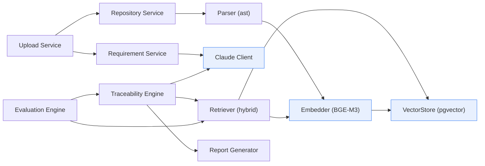
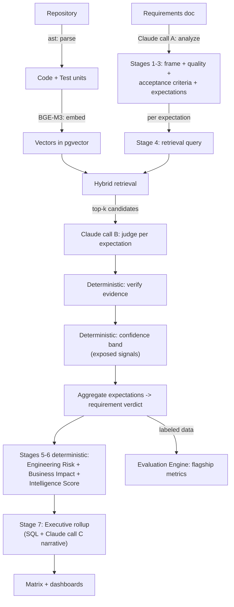
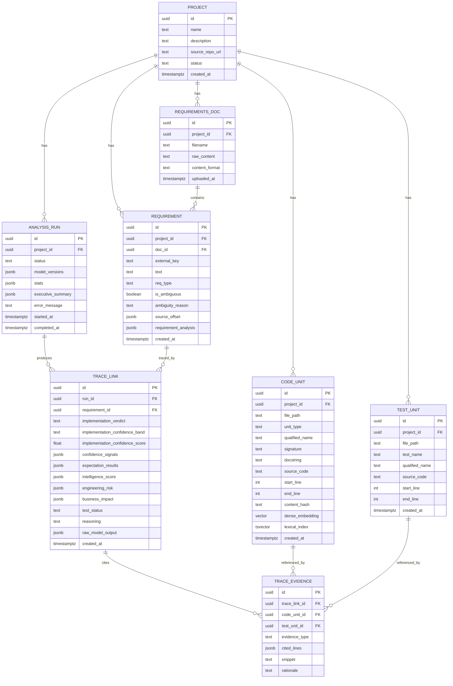
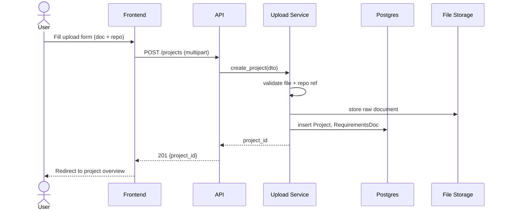
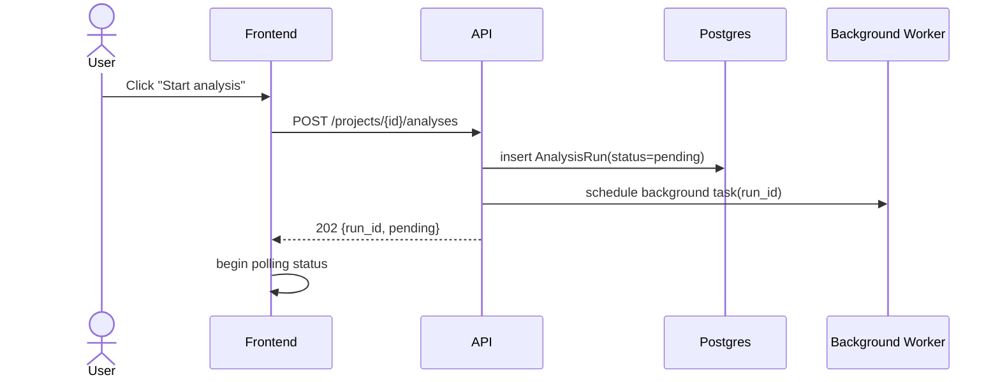
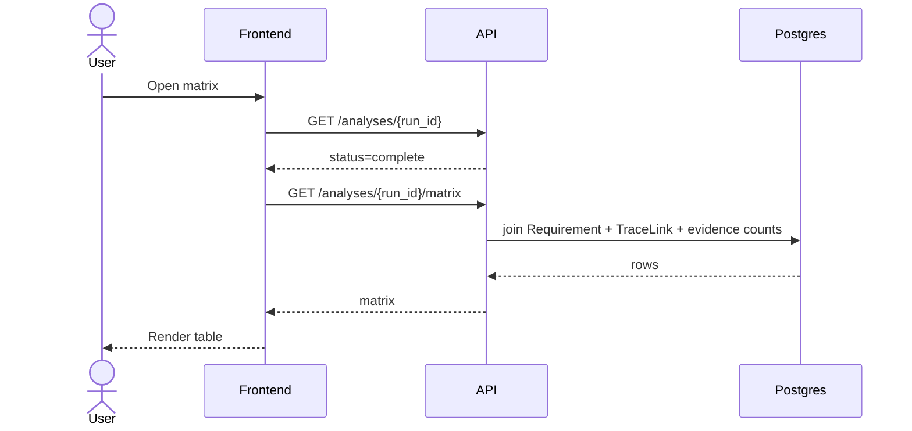

# System Design — FlowForge AI

**Product:** FlowForge AI — AI-Powered Requirements Intelligence & Engineering Decision Platform
**Document type:** Engineering design document (master implementation blueprint)
**Status:** Approved — ready for implementation
**Version:** 1.1 (reasoning-layer enrichment; physical architecture unchanged from 1.0)
**Date:** 2026-07-05
**Implements:** ADR-001 through ADR-022 (frozen)
**Audience:** Implementing engineers. This document is intended to be sufficient to build the system without further architectural clarification. Where an implementation detail elaborates a frozen ADR, it is noted inline and must stay within that ADR's intent.

> **v1.1 note.** This revision enriches the *reasoning layer only* — the seven-stage per-requirement pipeline (ADR-019), deterministic Engineering Risk / Business Impact (ADR-020), Executive Insights (ADR-021), the multi-dimensional Requirement Intelligence Score (ADR-022), and exposed confidence signals (ADR-010). The parser, embeddings, vector store, retrieval mechanics, execution model, folder architecture, and stack are unchanged. Edits touch §1, §3, §4, §5, §6, §9, §11, §15, §17.

---

## Table of contents

1. Executive Summary
2. High-Level System Architecture
3. Component Architecture
4. Complete Data Flow
5. AI Workflow
6. Database Design
7. Backend Architecture
8. Frontend Architecture
9. REST API Design
10. Sequence Diagrams
11. UI/UX Design
12. Error Handling Strategy
13. Security Considerations
14. Performance Strategy
15. Development Roadmap
16. Future Roadmap
17. Final Architecture Review

---

## 1. Executive Summary

### The platform

FlowForge AI is a web application that ingests a software project's **requirements document** and its **Python source repository** and reasons about each requirement the way an experienced Business Analyst / Senior Engineer / Tech Lead / Engineering Manager would. Its flagship output is an explainable **Requirement Traceability Matrix** — for every requirement, whether it is implemented, whether it is tested, and the exact evidence, with a confidence band and full provenance — wrapped in a per-requirement **reasoning pipeline** that also surfaces requirement intelligence, engineering risk, business impact, and project-level executive insights.

The MVP delivers a seven-stage per-requirement pipeline (ADR-019): **(1) Understand**, **(2) Requirement Intelligence**, **(3) Engineering Expectations**, **(4) Traceability** (flagship), **(5) Engineering Risk**, **(6) Business Impact**, **(7) Executive Insights**. Only Stages 1–4's factual outputs are rigorously evaluated; Stages 5–7 and the generative parts of 1–3 are decision-support advisories, honestly labeled (ADR-012, ADR-016).

### The business problem

Software teams lose the thread between what they promised to build (requirements) and what they actually shipped (code and tests). Requirements live in documents, code lives in repositories, and keeping them aligned is manual, slow, and error-prone. The current generation of AI code-review tools reads the diff and the codebase but cannot read the requirements, so it can tell you whether code is *correct* but not whether it is *what was asked for*. Requirements-management tools understand the requirements but not the code. Nothing links the two for a normal software team.

### The engineering solution

The platform closes that gap. For each requirement, one batched Claude call produces its semantic frame, quality assessment, acceptance criteria, and the **engineering expectations** an experienced engineer would expect to exist ("securely login" ⇒ password hashing, session management, lockout policy, …). Each expectation then drives the existing hybrid retrieval, and Claude judges implementation and test coverage per expectation — constrained to cite only retrieved evidence. Deterministic composites turn those results into engineering-risk and business-impact bands and a project-level executive rollup. The result is queryable, versioned per run, and — critically — **explainable**: no verdict is unsourced, and even the confidence is broken down into its contributing signals.

The guiding principle (ADR-008) is a hard boundary between **representation** and **judgment**. Deterministic components handle parsing, embedding, retrieval, and all scoring composites. Claude handles reasoning only (analysis, per-expectation verdicts, executive narrative), and only over a focused, retrieved context — never the whole repository.

### The AI pipeline (one sentence per stage)

Requirements document → **analyze** each requirement (frame + quality + acceptance criteria + engineering expectations, one call) → **parse** repo into code/test units → **embed** enriched units → per **expectation**, **hybrid-retrieve** candidates → **Claude verdict** (implemented / partial / missing, with reasoning + cited evidence + self-reported confidence) → **verify** evidence and compute the deterministic confidence band from exposed signals → **compose** deterministic engineering-risk and business-impact bands + the multi-dimensional intelligence score → **roll up** into executive insights (deterministic aggregation + one narrative call) → **assemble** the matrix and dashboards → **evaluate** the flagship against a labeled dataset to prove the numbers.

---

## 2. High-Level System Architecture

The system is a three-tier web application (Next.js frontend, FastAPI backend, PostgreSQL + pgvector) plus a set of in-process analysis components invoked by an asynchronous background worker. There is exactly one external reasoning dependency (the Claude API) and one local model dependency (BGE-M3 for embeddings).

```mermaid
flowchart TB
    subgraph Client["Frontend — Next.js / React / TS / Tailwind"]
        UI["Pages: Dashboard, Upload,\nStatus, Matrix, Detail,\nCoverage, Eval"]
    end

    subgraph API["Backend — FastAPI"]
        ROUTES["API Routes\n(projects, analyses, eval, health)"]
        SVC["Service Layer\n(orchestration)"]
        WORKER["Async Background Worker\n(FastAPI background task)"]
        ADAPT["Adapters\n(LLM, Embedder, VectorStore)"]
    end

    subgraph Data["Data Layer"]
        PG[("PostgreSQL + pgvector")]
        FS[("Object/File storage\nraw docs + cloned repo")]
    end

    subgraph External["External / Local Models"]
        CLAUDE["Claude API\n(reasoning only)"]
        BGE["BGE-M3\n(local embeddings)"]
    end

    UI -->|HTTPS / JSON| ROUTES
    ROUTES --> SVC
    SVC --> WORKER
    SVC --> PG
    WORKER --> ADAPT
    WORKER --> PG
    WORKER --> FS
    ADAPT --> CLAUDE
    ADAPT --> BGE
    ADAPT --> PG
```



### Components and why they exist

- **Frontend (Next.js).** Renders the upload flow, poll-based analysis status, and the read-only reporting views (matrix, coverage, requirement detail, evaluation dashboard). It never talks to Claude or the database directly; it only calls the backend REST API. Rationale: keep all secrets and reasoning server-side (ADR-018, §13).
- **API routes (FastAPI).** The synchronous HTTP surface. Thin: validate input, delegate to services, return JSON. Rationale: a clear boundary between transport and logic (ADR-015).
- **Service layer.** Orchestrates use cases (create project, start analysis, fetch report). Owns transactions. Rationale: business logic lives here, not in routes or adapters.
- **Async background worker.** Runs the multi-minute analysis pipeline off the request path (ADR-013). Rationale: analysis takes minutes; a synchronous request would time out.
- **Adapters (LLM, Embedder, VectorStore).** The only swappable/mockable seams (ADR-015). Rationale: isolate the two model dependencies and vector search so they can be tested and replaced without touching business logic.
- **PostgreSQL + pgvector.** Single datastore for metadata, artifacts, embeddings, and results (ADR-006, ADR-014). Rationale: one transactional store; no second system to keep in sync.
- **File storage.** Holds the raw uploaded document and the cloned repository during analysis. Rationale: large blobs don't belong in relational rows.
- **Claude API.** The sole reasoning engine (ADR-008). **BGE-M3.** Local embeddings, dense + used alongside lexical retrieval (ADR-004).

### How components communicate

Frontend ↔ backend over HTTPS/JSON. Within the backend, calls are in-process Python function calls following a strict inward dependency direction (routes → services → adapters/domain). The worker communicates with the frontend only indirectly: it writes run status and results to Postgres, and the frontend polls a status endpoint (ADR-013). Adapters call out to the Claude API (HTTPS) and BGE-M3 (in-process) and read/write vectors in Postgres.

---

## 3. Component Architecture

The backend decomposes into ten logical components. Only three (LLM Client, Embedder, VectorStore) are formal adapters behind interfaces; the rest are services/utilities called directly (ADR-015 — adapters are reserved for the components actually mocked or swapped).

**v1.1 mapping (no new components).** The reasoning enrichment slots into existing components: **Requirement Service** now issues the batched Requirement Analysis call (Stages 1–3); **Traceability Engine** runs per-expectation verdicts (Stage 4) and hosts the deterministic Risk/Impact/Intelligence composers (Stages 5–6) as pure functions; **Report Generator** produces the executive rollup (Stage 7). No new services, adapters, datastores, or interfaces are introduced — only new prompts (`prompts/`), schemas, JSONB fields, and pure-function composers.



### Responsibility boundaries

| Component | Responsibility | Must NOT do |
|---|---|---|
| **Upload Service** | Accept + validate a requirements doc and a repo (URL or zip); create the `Project`; persist raw artifacts; kick off nothing heavy. | Parse code, call models. |
| **Requirement Service** | Orchestrate requirement extraction and ambiguity analysis via Claude Client; persist `Requirement` rows with provenance. | Retrieve code, produce verdicts. |
| **Repository Service** | Fetch/clone (GitPython) or unzip the repo; enumerate Python files safely; hand files to Parser. | Execute repo code; call Claude. |
| **Parser (ast)** | Turn Python source into `CodeUnit` and `TestUnit` records (qualified name, signature, docstring, source, line span). | Run/import the target code (ast parses without executing). |
| **Embedder (adapter)** | Produce dense embeddings for enriched code units via BGE-M3; expose content-hash caching. | Judge relevance; make verdicts. |
| **Retriever** | For a requirement, run hybrid retrieval (dense + lexical), fuse, return ranked candidate code units with scores. | Decide implemented/not (that's reasoning). |
| **Claude Client (adapter)** | Wrap the Claude API: structured outputs, prompt caching, model tiering, retries, usage logging. Provide `extract_requirements`, `analyze_ambiguity`, `judge_traceability`. | Parse, embed, retrieve, or compute confidence bands. |
| **Traceability Engine** | Per requirement: retrieve → Claude verdict → verify evidence → compute confidence band → persist `TraceLink` + evidence. | Talk HTTP; render UI. |
| **Evaluation Engine** | Run the labeled dataset through retrieval + traceability; compute retrieval recall@k, verdict precision/recall, extraction quality, confidence-band separation. | Modify production data. |
| **Report Generator** | Assemble the matrix, coverage summary, and risk list into API-serializable structures. | Call models or retrieve. |

### Dependency direction

Dependencies point inward toward the domain. `Upload → Repository/Requirement → Parser → Embedder → VectorStore`; `Traceability → Retriever → (Embedder, VectorStore)` and `Traceability → Claude Client`; `Evaluation` composes the same Retriever + Traceability primitives against fixed inputs. No component reaches "up" the chain; the domain model depends on nothing.

---

## 4. Complete Data Flow

Numbered end to end, from upload to the final matrix. Steps 1–5 are synchronous (request path); steps 6–18 run in the background worker.

1. **Upload.** User submits a requirements document (Markdown/plain text; PDF is a stretch per ADR-003) plus a GitHub URL or a repo zip.
2. **Validation.** Upload Service validates file type/size and repo reference (§13); rejects on failure with a 4xx.
3. **Persist artifacts.** Raw document stored to file storage; a `Project` and `RequirementsDoc` row created.
4. **Repo acquisition record.** The repo URL (or uploaded zip path) is recorded on the project; the heavy fetch is deferred to the worker.
5. **Analysis kickoff.** User starts an analysis; API creates an `AnalysisRun` (status `pending`), schedules the background task, and returns `run_id` immediately (ADR-013).
6. **Repo fetch.** Worker (Repository Service) shallow-clones the repo (or unzips) into isolated storage; run status → `running`.
7. **File enumeration.** Python files discovered; non-Python and oversized/generated files skipped-and-logged.
8. **Parse.** Parser walks each file's AST into `CodeUnit`s (functions/classes/methods) and `TestUnit`s, each with file path, line span, signature, and docstring. Per-file failures are caught and logged (§12); parsing never executes code.
9. **Enrich.** Each code unit's embedding text is composed as `qualified_name + signature + docstring + source` (ADR-005).
10. **Embed.** Embedder generates dense vectors via BGE-M3 (content-hash cached to skip re-embedding unchanged units on re-runs). Vectors written to `code_unit.dense_embedding` (pgvector).
11. **Lexical index.** Identifier text (names/signatures/docstrings) is indexed for lexical retrieval (Postgres full-text/trigram) — the lexical half of hybrid retrieval (ADR-007).
12. **Analyze requirements (Stages 1–3).** In parallel with 6–11 (independent input), Requirement Service sends the document (chunked by section) to Claude in one batched structured call per requirement → atomic `Requirement` with stable key, type, ambiguity flag, semantic frame, acceptance criteria, engineering **expectations**, and advisory intelligence dimensions, plus document source offset. Stored in `requirement` + `requirement.requirement_analysis` JSONB.
13. **Retrieve (per expectation).** For each **engineering expectation** of each requirement, Retriever runs dense + lexical retrieval, fuses via reciprocal rank fusion, and returns top-k candidate code units (and candidate tests) with scores. (Expectations are tighter queries than whole requirements — sharper retrieval.)
14. **Judge (Stage 4, per expectation).** Traceability Engine sends the expectation + retrieved candidates to Claude Client → structured verdict: implemented/partial/missing, reasoning, cited evidence (units + lines), test status, self-reported confidence (ADR-009 role B).
15. **Verify evidence.** Engine confirms every cited unit was in the candidate set (rejects hallucinated citations) and that "implemented" carries ≥1 citation; invalid outputs retried, then downgraded to `analysis_error` (§12).
16. **Confidence band (exposed signals).** Deterministic code composes the **High/Med/Low** band from four stored signals — retrieval quality, evidence strength (margin), implementation matches, reasoning confidence — into `trace_link.confidence_signals` (ADR-010). Claude does not compute the band.
17. **Aggregate + score (Stages 5–6).** Per-expectation verdicts aggregate into the requirement verdict; deterministic composites compute Engineering Risk, the six Business Impact dimensions, and the five-dimension Intelligence Score (ADR-020, ADR-022), each with a short Claude-written rationale where useful. `TraceLink` + `TraceEvidence` written under `run_id`; run stats accumulated.
18. **Executive rollup + complete (Stage 7).** Report Generator aggregates project-level metrics (quality, coverage, risk, priorities, recommended actions) via SQL; one Claude narrative call (role C) summarizes them into `analysis_run.executive_summary`; run status → `complete`. Frontend's next poll renders the matrix and dashboards.

---

## 5. AI Workflow

This section states, per stage, **exactly what Claude does and does not do**. The through-line: Claude reasons over focused, provided context and returns structured output; everything mechanical is deterministic code.



The seven stages map to exactly **three Claude call roles** (A: analysis, B: per-expectation verdict, C: executive narrative); everything else is deterministic (ADR-009, ADR-019).

| Stage | Claude DOES | Claude does NOT |
|---|---|---|
| **1. Understand** (call A) | Extract the semantic frame: actor, action, object, constraints, domain, feature category — schema-valid JSON. | Invent content ungrounded in the requirement text. |
| **2. Requirement Intelligence** (call A) | Flag ambiguity/vagueness (verifiable); judge Clarity/Completeness/Testability as advisory bands; generate acceptance criteria (advisory). | Assert missing requirements as *fact*; detect contradictions (deferred — ADR-012). |
| **3. Engineering Expectations** (call A) | Infer the components an experienced engineer would expect (e.g., hashing, session mgmt, lockout) as advisory, retrieval-driving items. | Present expectations as defects; look at code (this precedes repo analysis). |
| **4. Traceability** (call B, per expectation) | Judge Implemented / Partial / Missing over the *provided* candidates; reasoning; cite specific units/lines; self-report confidence. | See code outside retrieved candidates; access DB/filesystem/internet; compute similarity or select candidates (Retriever does). |
| **5. Engineering Risk** | Provide a short *rationale* only. | Compute the band — deterministic from implementation gap, test gap, quality, confidence (ADR-020). |
| **6. Business Impact** | Provide a short *rationale* only. | Compute the six dimension bands (Rework, Release Delay, Defect Risk, Testing Effort, Maintenance Effort, Priority) — deterministic (ADR-020). No compliance/audit. |
| **7. Executive Insights** (call C) | Narrate the already-computed rollup in prose. | Compute the aggregates — deterministic SQL does (ADR-021). |
| **Code Parsing / Embedding / Retrieval** | *Nothing.* | `ast` parses; BGE-M3 embeds; Retriever retrieves. |
| **Evidence Verification / Confidence Band** | Contribute self-reported confidence only. | Verify its own citations or compute the band — deterministic code checks citations are in-candidate-set and composes the band from four exposed signals (retrieval quality, evidence strength, implementation matches, reasoning confidence — ADR-010). |
| **Intelligence Score / Evaluation** | *Nothing.* | Compute Traceability/Coverage dimensions or score itself — deterministic (ADR-022); the Evaluation Engine measures the flagship against labeled data (ADR-016). |

Per-expectation verdicts aggregate into the requirement verdict: all satisfied → Implemented; some → Partial (with the specific unmet expectations listed); none → Missing. This is what turns a vague "Partial" into "3 of 5 expected components present — missing lockout policy, MFA."

Anti-hallucination rules baked into calls A and B (ADR-009, ADR-011, ADR-012): cite only provided candidates; "Missing" is an expected, correct answer; quote the specific lines relied upon so evidence *correctness* is checkable; present expectations/criteria as advisory suggestions, never factual defects; treat all requirement and code content as untrusted data, not instructions (§13).

---

## 6. Database Design

PostgreSQL with the `pgvector` and `pg_trgm` extensions. Normalized core + JSONB for flexible model payloads (ADR-014). Multi-unit evidence for both code and tests is realized with a `trace_evidence` join table — the concrete implementation of ADR-011's "a verdict may cite multiple units," kept relational for matrix queries, with raw model output preserved in JSONB.



### Per-table notes

- **project** — Purpose: top-level container. Indexes: PK. FKs: none. Relationships: 1-to-many with docs, requirements, code/test units, runs.
- **requirements_doc** — Purpose: raw uploaded document. Fields: `raw_content` (or a storage pointer for large docs), `content_format`. FK: `project_id`. Index: `(project_id)`.
- **requirement** — Purpose: atomic requirement with quality flags and upstream provenance. Fields: `external_key` (e.g., `REQ-001`), `req_type`, `is_ambiguous`, `ambiguity_reason`, `source_offset` (location in doc), **`requirement_analysis` (jsonb)** — the Stage 1–3 payload: semantic frame (actor/action/object/constraints/domain/category), acceptance criteria, engineering expectations (advisory), and the LLM-judged intelligence dimensions (clarity/completeness/testability) (ADR-003/019/022). FKs: `project_id`, `doc_id`. Indexes: `(project_id)`, unique `(project_id, external_key)`.
- **code_unit** — Purpose: citeable unit of implementation. Fields include `content_hash` (embedding cache key), `dense_embedding` **vector(1024)** (BGE-M3), `lexical_index` **tsvector** (identifiers/docstring). FK: `project_id`. **pgvector usage:** HNSW index on `dense_embedding` for cosine similarity (ivfflat acceptable fallback). Indexes: `(project_id)`, GIN on `lexical_index`, HNSW on `dense_embedding`, `(content_hash)`.
- **test_unit** — Purpose: citeable unit of test coverage. FK: `project_id`. Index: `(project_id)`, `(file_path)`.
- **analysis_run** — Purpose: one analysis execution; the versioning anchor (ADR-013/014). Fields: `status` (`pending|running|complete|failed`), `model_versions` (jsonb), `stats` (jsonb: counts, tokens, cost, cache hits), **`executive_summary` (jsonb)** — the Stage 7 rollup: project quality/coverage/risk aggregates, priority requirements, recommended actions, and the narrative (ADR-021), `error_message`. FK: `project_id`. Index: `(project_id, status)`, `(project_id, started_at)`.
- **trace_link** — Purpose: one aggregated verdict per (run, requirement). Fields: `implementation_verdict` (`implemented|partial|missing|analysis_error`), `implementation_confidence_band` (`high|medium|low`), `implementation_confidence_score`, **`confidence_signals` (jsonb)** — the four exposed signals (retrieval quality, evidence strength, implementation matches, reasoning confidence; ADR-010), **`expectation_results` (jsonb)** — per-expectation verdicts feeding the aggregate (ADR-019), **`intelligence_score` (jsonb)** — the five dimensions (ADR-022), **`engineering_risk` (jsonb)** and **`business_impact` (jsonb)** — deterministic bands + rationale (ADR-020), `test_status` (`covered|partial|uncovered`), `reasoning`, `raw_model_output` (jsonb). FKs: `run_id`, `requirement_id`. Indexes: `(run_id, requirement_id)` unique, `(run_id)`.
- **trace_evidence** — Purpose: multi-unit evidence for code and tests. Fields: `evidence_type` (`implementation|test`), `cited_lines` (jsonb), `snippet`, `rationale`. FKs: `trace_link_id`, nullable `code_unit_id`, nullable `test_unit_id` (exactly one set per row per `evidence_type`). Indexes: `(trace_link_id)`, `(code_unit_id)`.

---

## 7. Backend Architecture

FastAPI project, layered per ADR-015. Dependencies point inward: `api → services → domain`; `services → adapters` (via interfaces); `adapters → external`. `domain` depends on nothing.

```
backend/
  app/
    main.py                 # FastAPI app; router + middleware + exception handlers
    api/
      routes/
        projects.py         # project CRUD + upload
        analyses.py         # start/status/results endpoints
        eval.py             # read-only evaluation metrics
        health.py           # liveness/readiness
      deps.py               # DI: db session, settings
    services/
      upload_service.py
      requirement_service.py
      repository_service.py
      traceability_engine.py
      evaluation_engine.py
      report_generator.py
    domain/
      models.py             # SQLAlchemy ORM entities
      schemas.py            # Pydantic request/response DTOs
      enums.py              # Verdict, RunStatus, ConfidenceBand, TestStatus
    adapters/
      llm/claude_client.py          # interface + Anthropic implementation
      embeddings/bge_embedder.py     # interface + BGE-M3 implementation
      vectorstore/pgvector_store.py  # interface + pgvector implementation
      repo/git_client.py             # GitPython wrapper (not an adapter interface; utility)
      parser/python_ast_parser.py    # ast → units (utility)
    prompts/
      extraction.py         # system prompt + schema + few-shot
      ambiguity.py
      traceability.py       # rubric + anti-hallucination rules + schema
    core/
      config.py             # env-driven Settings
      db.py                 # engine, session factory
      logging.py            # structured JSON logging
      errors.py             # exception types
      worker.py             # background task runner + run lifecycle
    eval/
      dataset/              # labeled sample project (requirements + repo + gold links)
      runner.py             # orchestrates eval
      metrics.py            # recall@k, precision/recall, calibration separation
  migrations/               # Alembic
  tests/
  Dockerfile
  pyproject.toml
  .env.example
```

### Module communication and service boundaries

- **Routes** call **services** and never touch adapters directly. They convert Pydantic DTOs ↔ domain and map exceptions to HTTP status codes.
- **Services** own transactions and orchestration. `traceability_engine` composes `Retriever` (implemented over `pgvector_store` + `bge_embedder`) and `claude_client`. `worker.py` invokes `repository_service → parser → embedder`, then `requirement_service`, then `traceability_engine`, then `report_generator`, updating `AnalysisRun` status at each boundary.
- **Adapters** are the only mockable seams; tests inject fakes for `claude_client`, `bge_embedder`, and `pgvector_store`.
- **Domain** (`models`, `schemas`, `enums`) is dependency-free and importable everywhere.

---

## 8. Frontend Architecture

Next.js (App Router), TypeScript, Tailwind. Server state via TanStack Query (caching + polling); minimal client state (React state/context only — no heavy global store needed). All data via the backend REST API; no secrets client-side.

```
frontend/
  app/
    layout.tsx                       # shell, nav, query provider
    page.tsx                         # Dashboard (projects list)
    projects/
      new/page.tsx                   # Upload
      [projectId]/
        page.tsx                     # Project overview + runs
        analyses/[runId]/
          page.tsx                   # Analysis Status (polls) -> Matrix when complete
          matrix/page.tsx            # Requirement Traceability Matrix
          coverage/page.tsx          # Coverage Summary
          requirements/[reqId]/page.tsx  # Requirement Details
    eval/page.tsx                    # Evaluation Dashboard
  components/
    MatrixTable.tsx  VerdictBadge.tsx  ConfidenceBadge.tsx
    CoverageChart.tsx  UploadForm.tsx  StatusPoller.tsx  EvidencePanel.tsx
  lib/
    api.ts                           # typed fetch client
    types.ts                         # shared response types
  hooks/
    useAnalysisStatus.ts             # polling hook (stops on complete/failed)
    useMatrix.ts  useCoverage.ts
  styles/
  public/
```

### Pages and navigation

- **Dashboard (`/`)** — lists projects; entry to create a new one or open an existing project. Nav root.
- **Upload (`/projects/new`)** — form for name, requirements file, repo URL/zip; on submit → project overview.
- **Project overview (`/projects/[id]`)** — project metadata + list of analysis runs; "Start analysis" button.
- **Analysis Status (`/projects/[id]/analyses/[runId]`)** — polls `useAnalysisStatus`; shows progress; auto-navigates to Matrix on `complete`, shows error on `failed`.
- **Matrix (`.../matrix`)** — the flagship view: requirement rows × verdict/confidence/test columns; row click → requirement detail.
- **Requirement Detail (`.../requirements/[reqId]`)** — requirement text, ambiguity flag, verdict, reasoning, and the `EvidencePanel` (cited code/test snippets with line spans).
- **Coverage (`.../coverage`)** — summary metrics + `CoverageChart` + risk list.
- **Evaluation Dashboard (`/eval`)** — retrieval recall@k, verdict precision/recall, confidence-band separation from the latest eval run.

**State management.** TanStack Query caches all server reads and drives status polling (interval query that stops when status is terminal). No client-side duplication of server state; forms use local component state.

**API communication.** A single typed `lib/api.ts` wraps `fetch`, sets the base URL from env, and returns typed responses; errors surface as thrown objects mapped to UI toasts.

---

## 9. REST API Design

Base path `/api`. JSON everywhere. Validation via Pydantic; consistent error envelope `{ "error": { "code", "message", "details" } }`.

| Method | Route | Request | Success | Errors |
|---|---|---|---|---|
| GET | `/health` | — | 200 `{status:"ok"}` | — |
| POST | `/projects` | multipart: `name`, `requirements_file`, `repo_url` or `repo_zip` | 201 `{project_id}` | 400 (bad file/URL), 413 (too large), 422 (validation) |
| GET | `/projects` | — | 200 `[{id,name,status,created_at}]` | — |
| GET | `/projects/{id}` | — | 200 project + runs summary | 404 |
| POST | `/projects/{id}/analyses` | `{}` | 202 `{run_id, status:"pending"}` | 404, 409 (run already active) |
| GET | `/analyses/{run_id}` | — | 200 `{status, progress, stats, error_message?}` | 404 |
| GET | `/analyses/{run_id}/matrix` | — | 200 matrix rows (verdict, confidence band, test status, intelligence score, risk band) | 404, 409 (not complete) |
| GET | `/analyses/{run_id}/coverage` | — | 200 coverage summary + risks | 404, 409 |
| GET | `/analyses/{run_id}/executive` | — | 200 executive insights (quality/coverage/risk aggregates, priorities, recommended actions, narrative) | 404, 409 |
| GET | `/analyses/{run_id}/requirements/{req_id}` | — | 200 requirement + analysis (frame, expectations, intelligence) + trace_link (verdict, confidence_signals, expectation_results, risk, impact) + evidence | 404, 409 |
| GET | `/projects/{id}/requirements` | — | 200 requirement list | 404 |
| GET | `/eval/latest` | — | 200 flagship metrics summary | 404 (none run) |

**Representative payloads.**

`POST /projects/{id}/analyses` → `202 { "run_id": "…", "status": "pending" }`

`GET /analyses/{run_id}/matrix` →
```json
{ "run_id":"…","rows":[
  {"requirement_id":"…","external_key":"REQ-001","text":"…","is_ambiguous":false,
   "implementation_verdict":"implemented","confidence_band":"high",
   "test_status":"covered","evidence_count":2}
]}
```

**Status-code conventions.** 2xx success (`202` for accepted async work); `400/413/422` client/input errors; `404` missing resource; `409` state conflict (result requested before completion, or duplicate active run); `500` unexpected; `502/503` upstream (Claude) failure surfaced when synchronous. **Validation:** filenames sanitized, size caps enforced, repo URL scheme allowlisted (§13); all bodies validated by Pydantic models with explicit field constraints.

---

## 10. Sequence Diagrams

### 10.1 Upload Project


### 10.2 Start Analysis


### 10.3 Background Processing
```mermaid
sequenceDiagram
    participant W as Worker
    participant REPO as Repository Service
    participant P as Parser
    participant EMB as Embedder
    participant REQ as Requirement Service
    participant TR as Traceability Engine
    participant RG as Report Generator
    participant DB as Postgres
    W->>DB: status=running
    W->>REPO: fetch repo
    REPO->>P: enumerate + parse files
    P->>DB: insert CodeUnits, TestUnits
    W->>EMB: embed code units (hash-cached)
    EMB->>DB: write vectors
    W->>REQ: analyze requirements (Stages 1-3, call A)
    REQ->>DB: insert Requirements + requirement_analysis
    W->>TR: traceability per expectation (Stage 4, call B)
    TR->>DB: write TraceLinks + Evidence + confidence_signals
    W->>TR: compose risk/impact/intelligence (Stages 5-6, deterministic)
    TR->>DB: write engineering_risk, business_impact, intelligence_score
    W->>RG: executive rollup (Stage 7, SQL + call C)
    RG->>DB: persist executive_summary; status=complete
```

### 10.4 Requirement Analysis (extraction + ambiguity)
```mermaid
sequenceDiagram
    participant REQ as Requirement Service
    participant CL as Claude Client
    participant CLAUDE as Claude API
    participant DB as Postgres
    REQ->>REQ: chunk document by section
    loop each chunk
        REQ->>CL: extract_requirements(chunk)
        CL->>CLAUDE: messages + JSON schema (Haiku)
        CLAUDE-->>CL: structured requirements
        CL->>CL: validate schema; retry if invalid
        CL-->>REQ: requirements + ambiguity flags
    end
    REQ->>DB: insert Requirements (with offsets)
```

### 10.5 Traceability Analysis (per requirement)
```mermaid
sequenceDiagram
    participant TR as Traceability Engine
    participant RT as Retriever
    participant VS as VectorStore
    participant CL as Claude Client
    participant CLAUDE as Claude API
    participant DB as Postgres
    loop each requirement
        TR->>RT: retrieve(requirement)
        RT->>VS: dense + lexical search
        VS-->>RT: candidates + scores
        RT-->>TR: fused top-k
        TR->>CL: judge_traceability(req, candidates)
        CL->>CLAUDE: cached rubric + candidates (Sonnet, JSON)
        CLAUDE-->>CL: verdict + reasoning + citations + self-confidence
        CL-->>TR: structured verdict
        TR->>TR: verify citations; retry/downgrade if invalid
        TR->>TR: compute confidence band (deterministic)
        TR->>DB: insert TraceLink + TraceEvidence
    end
```

### 10.6 Dashboard Loading


---

## 11. UI/UX Design

Clean, dense, report-like. Every verdict is one click from its evidence — trust is the product.

**Dashboard.** Project cards + "New project."
```
+--------------------------------------------------+
|  Requirements Intelligence         [ + New ]     |
+--------------------------------------------------+
|  [ Project: PaymentsAPI ]  status ● complete     |
|   3 runs · 42 reqs · 76% implemented             |
|  [ Project: AuthService ]  status ◐ running      |
+--------------------------------------------------+
```

**Upload.** Name, requirements file, repo URL/zip, Start.
```
+------------------------------------------+
|  New Project                             |
|  Name        [___________________]       |
|  Requirements [ choose file .md ]        |
|  Repository  ( ) GitHub URL [________]   |
|              ( ) Upload .zip [ choose ]  |
|                       [ Create Project ] |
+------------------------------------------+
```

**Analysis Status.** Live-polled progress.
```
Analyzing PaymentsAPI …  ▓▓▓▓▓▓░░░  running
Parsed 128 units · Extracted 42 reqs · Judged 30/42
```

**Requirement Matrix.** The flagship. Now carries the intelligence score and engineering risk alongside the verdict so managers scan weak/high-risk rows fast.
```
Req      Requirement (short)   Impl         Conf  Tests       Intel  Risk
REQ-001  Validate email format ● Implemented  H   ✓ Covered   ▮▮▮▮▮  Low
REQ-002  Rate-limit login      ◐ Partial      M   ✗ Uncovered ▮▮▮░░  High
REQ-003  Export report as PDF  ○ Missing      H   –           ▮▮░░░  Med
        (row click → detail · Intel = 5-dim score · Risk = deterministic band)
```

**Requirement Details.** The full reasoning pipeline for one requirement: intelligence, expectations vs. evidence, verdict, explainable confidence, risk/impact.
```
REQ-002  Rate-limit login attempts      [Ambiguous ⚠ "attempts" undefined]
Frame: actor=User · action=limit · object=login attempts · domain=Auth

Intelligence Score   Clarity ▮▮▮░░  Complete ▮▮░░░  Testable ▮▮▮▮░
                     Traceability ▮▮▮░░  Coverage ▮▮░░░   (advisory* / measured)
Acceptance criteria (advisory): lockout after N fails; window resets; audit log
Expectations vs evidence (Stage 3→4):
  ✓ throttling         auth/middleware.py:41–58  def throttle(...)
  ✗ lockout policy     — not found
  ✗ MFA                — not found
Verdict: Partial   → 1 of 3 expected components present
Confidence: Medium   signals[ retrieval .72 · margin .18 · matches 1/3 · model .6 ]
Engineering Risk: High   (impl gap + untested + ambiguous)
Business Impact: Rework ▲ · Defect risk ▲ · Testing effort ▲ · Priority: High
```

**Coverage Summary.** Metrics + chart + risks.
```
Implemented 76% | Tested 54% | Missing 7
Risks (unimpl/untested, ranked):  REQ-003, REQ-011, REQ-019 …
[ bar/donut: Implemented / Partial / Missing ]
```

**Executive Insights (Stage 7).** Project health at a glance for engineering managers.
```
FlowForge · PaymentsAPI — Run #3
Requirement quality 68/100 · Implementation 76% · Testing 54% · Risk: Elevated
Highest-priority requirements:  REQ-002, REQ-011, REQ-019
Recommended actions: add lockout+MFA (REQ-002); add tests for 6 untested reqs …
Narrative: "Coverage is solid but auth hardening and test depth are the main gaps…"
```

**Evaluation Dashboard.** Proof the system works.
```
Retrieval recall@10: 0.88   Verdict precision: 0.81  recall: 0.79
Confidence separation: High 0.90 acc · Med 0.66 · Low 0.41
```

---

## 12. Error Handling Strategy

- **Invalid repositories.** URL scheme/host allowlist and size cap at validation (§13); clone failures set the run `failed` with a user-facing `error_message`; never crash the process.
- **Broken Python files.** Each file parsed in its own try/except; failures are skipped-and-logged with path + reason; the run proceeds (partial parse is acceptable).
- **Claude failures.** Structured-output + schema validation catches malformed responses; transient API errors (timeouts, 429, 5xx) are retried with exponential backoff and jitter (max N attempts); on persistent failure for a single requirement, that `TraceLink` is recorded as `analysis_error` and the run still completes (partial analysis) rather than failing wholesale.
- **Retry strategy.** Central retry policy in `claude_client` and `git_client`: exponential backoff, capped attempts, respect `Retry-After`; every retry logged with attempt count.
- **Database failures.** All multi-write steps run in transactions; a failed transaction rolls back and marks the run `failed`; connection issues bubble to a 500 with the error envelope.
- **Partial analysis.** First-class: runs complete with a mix of verdicts including `analysis_error`; the matrix shows those rows distinctly so the user sees exactly what could and couldn't be judged.
- **Logging.** Structured JSON logs; every LLM call logs model, tokens, cost, latency, cache hit/miss (§14, ADR-017); errors carry a correlation id (`run_id`).
- **Validation.** Pydantic on all inputs; LLM outputs validated against their JSON schema; evidence citations validated against the candidate set before persistence.

---

## 13. Security Considerations

- **File uploads.** Enforce type and size limits; sanitize filenames; store outside any web root; never render uploaded content as HTML.
- **Repository validation.** Allowlist URL scheme/host; shallow-clone with depth 1; cap repo size and file count; time-box the clone. **We never execute the target repository** — `ast` parses without importing or running code; there is no `exec`/`import` of uploaded code anywhere. State this as a deliberate safety property.
- **Secrets.** All secrets via environment variables; `.env.example` documents names only; nothing committed; secrets injected at deploy from the platform's secret store.
- **Claude API keys.** Server-side only; never sent to the frontend or embedded in responses; not logged.
- **Input validation.** Pydantic constraints on every field; reject oversized or malformed payloads early.
- **Prompt injection.** Requirement text and repository code are **untrusted data**. The verdict/extraction prompts (a) place untrusted content in clearly delimited data sections, (b) instruct the model to treat that content as data, not instructions, (c) rely on structured outputs so a hijack cannot change the response shape, and (d) constrain citations to the provided candidate set so injected "ignore previous instructions" text cannot manufacture evidence. Because retrieved code is never executed, injection cannot escalate beyond text.
- **Sensitive code.** Full source is not logged at info level; consider Claude API zero-data-retention/workspace options for sensitive repositories; document that code is sent to the Claude API for reasoning so users can make an informed choice.

---

## 14. Performance Strategy

- **Async processing.** Analysis runs in a background task off the request path (ADR-013); the UI polls status.
- **Prompt caching.** The stable verdict prefix (system prompt + rubric + few-shot) is marked cacheable; only per-requirement candidates vary, so cache reads bill at a fraction of input cost across all requirements in a run (ADR-009). Cache hit-rate is logged.
- **Embedding caching.** `code_unit.content_hash` keys an embedding cache; unchanged units are not re-embedded on re-runs.
- **Model tiering.** Haiku for high-volume narrow tasks (extraction, ambiguity); Sonnet for correctness-critical verdicts; Opus only for genuinely hard cases (ADR-009). Explicit `max_tokens` per call.
- **Database indexing.** HNSW on `dense_embedding`; GIN on `lexical_index`; composite indexes on `(run_id, requirement_id)` and `(project_id, status)`. Matrix assembled with a single join query.
- **Cost optimization.** Only retrieved context reaches Claude (never the whole repo); per-run token/cost accounting stored in `analysis_run.stats`; caps and backoff prevent runaway spend.

---

## 15. Development Roadmap

Milestones are ≤2 days each and each leaves the project runnable. Ordering front-loads a thin end-to-end path (walking skeleton), then deepens quality. Sized for a one-month solo build. The v1.1 reasoning enrichment lands mainly on **M5** (extraction → full Requirement Analysis) and **M7** (per-expectation traceability) plus a new **M7b** (deterministic risk/impact/executive); it consumes the week-4 buffer, so if anything slips it slips into polish while the evaluated flagship still lands.

**M0 — Scaffold & CI (0.5–1d).** *Objective:* runnable shell. *Deliverables:* monorepo, Docker Compose (API + Postgres+pgvector), FastAPI `/health`, GitHub Actions running lint+tests. *Acceptance:* `docker compose up` serves `/health` 200; CI green. *Risks:* pgvector image setup.

**M1 — Data model & migrations (1d).** *Objective:* schema exists. *Deliverables:* all ORM models + Alembic migration + enums; extensions enabled. *Acceptance:* migrations apply cleanly; tables present. *Risks:* vector/tsvector column setup.

**M2 — Upload Service (1–2d).** *Objective:* create projects. *Deliverables:* `POST/GET /projects`, validation, artifact storage. *Acceptance:* upload creates Project + RequirementsDoc; list/get work. *Risks:* multipart + size limits.

**M3 — Repository Service + Parser (1–2d).** *Objective:* repo → units. *Deliverables:* clone/unzip, file enumeration, `ast` → CodeUnits/TestUnits persisted, per-file error handling. *Acceptance:* a sample repo yields correct units with line spans. *Risks:* messy real-world files.

**M4 — Embedder + VectorStore (1d).** *Objective:* vectors stored. *Deliverables:* BGE-M3 embedding of enriched units, pgvector writes, content-hash cache, HNSW index. *Acceptance:* dense search returns sensible neighbors. *Risks:* model download/runtime on CPU.

**M5 — Requirement Analysis call (2d).** *Objective:* rich requirements in DB (Stages 1–3). *Deliverables:* Claude Client (structured outputs, retries, caching), the batched Requirement Analysis prompt/schema → extraction + ambiguity + frame + acceptance criteria + engineering expectations + advisory intelligence dimensions; chunking; provenance; `requirement_analysis` JSONB. *Acceptance:* sample doc yields atomic requirements each with expectations and flags. *Risks:* over/under-splitting; expectation quality — keep advisory (ADR-012).

**M6 — Retriever (1d).** *Objective:* candidates per requirement. *Deliverables:* dense + lexical retrieval, RRF fusion, top-k with scores. *Acceptance:* known requirement retrieves its known code in top-k. *Risks:* lexical/dense balance.

**M7 — Traceability Engine, per expectation (2d).** *Objective:* end-to-end skeleton complete. *Deliverables:* verdict prompt (rubric + anti-hallucination), retrieval + verdict **per engineering expectation**, aggregation into the requirement verdict, evidence verification, confidence band from the four exposed signals (`confidence_signals`), TraceLink + TraceEvidence + `expectation_results` persistence. *Acceptance:* full run over the sample project produces a matrix with per-expectation breakdown. *Risks:* citation hallucination; latency (bounded by expectation count).

**M7b — Risk / Impact / Intelligence / Executive (1–2d).** *Objective:* decision-support outputs. *Deliverables:* deterministic Engineering Risk + six Business Impact dimensions + five-dimension Intelligence Score composers (with Claude rationales); Stage-7 SQL rollup + one narrative call → `executive_summary`. *Acceptance:* matrix rows show intel + risk; executive view renders. *Risks:* keep composites deterministic — no LLM-invented scores (ADR-020).

**M8 — Report + result endpoints (1–2d).** *Objective:* results served. *Deliverables:* Report Generator (coverage/risks/executive), matrix/coverage/requirement-detail/executive endpoints. *Acceptance:* endpoints return correct aggregates. *Risks:* join performance.

**M9 — Async execution (1d).** *Objective:* non-blocking runs. *Deliverables:* background task, run lifecycle, status endpoint. *Acceptance:* start returns 202; status transitions to complete; results appear. *Risks:* task failure handling.

**M10 — Frontend (2d).** *Objective:* usable UI. *Deliverables:* upload, status polling, matrix (with intel + risk columns), requirement detail (expectations-vs-evidence, intelligence score, confidence-signal breakdown, risk/impact), coverage + chart, executive insights view. *Acceptance:* a user can upload → watch → read the matrix, evidence, and executive rollup. *Risks:* polling UX; keeping advisory panels visually distinct from factual verdicts.

**M11 — Evaluation harness (2d).** *Objective:* proof it works. *Deliverables:* labeled dataset (independently labeled), runner, metrics (recall@k, precision/recall, band separation), eval endpoint + page. *Acceptance:* `eval` produces metrics; numbers are plausible. *Risks:* label leakage — label before reading prompt logic.

**M12 — Optimization & observability (1d).** *Objective:* cost/latency + instrumentation. *Deliverables:* prompt caching, model tiering confirmed, per-call usage logging, run stats. *Acceptance:* cache hit-rate and cost per run visible. *Risks:* cache-key drift.

**M13 — Deploy & docs (1–2d).** *Objective:* shippable. *Deliverables:* Dockerized stack, frontend (Vercel) + backend (Railway/Render), README + demo script. *Acceptance:* public demo URL runs the full flow. *Risks:* env/secret config.

---

## 16. Future Roadmap

The frozen architecture is built to extend without redesign:

- **Multi-language support & Tree-sitter.** Parsing sits behind a `CodeParser` boundary (ADR-002); a Tree-sitter implementation slots in per language, producing the same `CodeUnit` shape. Nothing downstream changes.
- **Agentic retrieval.** The verdict step is a single Claude Client method; upgrading it to a tool-use loop that fetches more code on a retrieval miss (ADR-009 deferred) is a local change behind the same interface.
- **Architecture review / Bug analysis / Technical debt / Release readiness.** These are new analysis engines that reuse the same primitives (parser, embedder, retriever, Claude Client) and write their own result tables keyed by `run_id` — the `AnalysisRun` versioning model already supports multiple analysis types per run.
- **Precise confidence calibration & completeness detection.** Both graduate from experimental once more labeled data exists (ADR-010, ADR-012); the confidence band is already computed in one deterministic place, so swapping in a calibrated mapping is isolated.
- **Scale-out.** pgvector → dedicated vector DB and background task → message-broker queue are drop-in at the adapter/worker boundary (ADR-006, ADR-013).

---

## 17. Final Architecture Review

A last pass, staying within the frozen ADR.

**Weaknesses.** (1) Retrieval is the accuracy ceiling — a miss produces a confident "Not found." (2) The lexical channel is realized with Postgres full-text over identifiers rather than BGE-M3's learned-sparse output; this is a pragmatic MVP choice within ADR-007 and is the first thing to upgrade if recall lags. (3) Confidence bands are coarse by design; they inform, they don't guarantee.

**Technical risks.** Citation hallucination (mitigated by candidate-set verification), extraction granularity drift (mitigated by few-shot + eval), and non-determinism across runs (mitigated by low temperature + persisted results). Eval-label leakage remains the subtlest risk — enforce independent labeling (ADR-016).

**Scalability concerns.** **Per-expectation** fan-out to Claude is now the cost/latency driver (verdict calls ≈ Σ expectations, not Σ requirements); caching + tiering + the fixed 3-role budget hold it at MVP scale, but cap expectations-per-requirement (e.g., ≤ ~7) to bound it. Background tasks are single-process; concurrent large runs will contend — acceptable for a portfolio/demo, upgrade path is the broker (ADR-013). pgvector is comfortable to ~10^5 vectors; beyond that, revisit (ADR-006).

**Missing assumptions now made explicit.** Repositories are Python and reasonably sized; requirements documents fit the chunk-and-extract flow; the demo runs single-tenant without auth (ADR-018); the target repo is untrusted and never executed (§13); expectations-per-requirement are capped to bound cost.

**Future bottlenecks.** Claude rate limits during large runs (worsened by per-expectation fan-out — mitigate with the expectation cap and batching); CPU embedding time on large repos; single-worker throughput. Each has a documented, ADR-consistent upgrade path.

**v1.1 reasoning-layer review.** The enrichment adds no infrastructure, but it does three things worth watching: (1) it raises verdict-call volume — mitigated by the expectation cap and Haiku-tier analysis; (2) it adds advisory outputs whose credibility depends entirely on honest UI labeling — the factual/advisory boundary (ADR-012/016) must be visually unambiguous or the reliable outputs inherit the advisory ones' uncertainty; (3) deterministic risk/impact/intelligence composites must be computed in one place each (not scattered) so they stay auditable and testable. None of these alter a frozen decision.

**Recommended improvements (within ADR).** (1) Cache retrieval candidate sets per run so re-judging on retry doesn't re-retrieve. (2) Emit a per-run `stats` breakdown (tokens, cost, cache hit-rate, verdict distribution) — cheap, strong demo/interview artifact. (3) Store the exact prompt/response for a sampled subset of verdicts for eval debugging. (4) Unit-test the deterministic composers against fixed signal inputs — they're pure functions, so this is cheap and proves the scores aren't hand-wavy. All additive.

**Verdict.** The design is coherent, implementable in the milestone plan, and faithful to the ADR (now v1.1). The physical architecture is unchanged; the enrichment lives entirely in the reasoning layer. Proceed to implementation.
