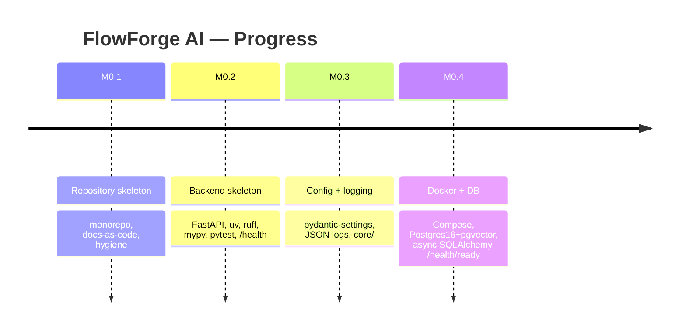
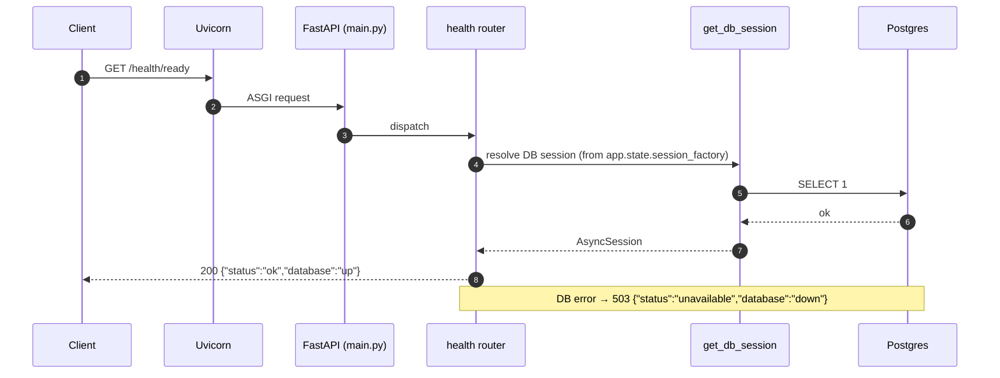
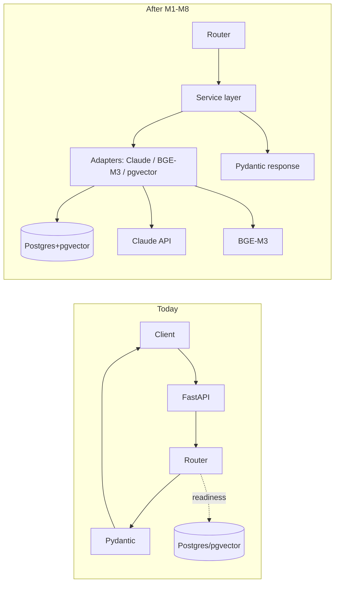

# FlowForge AI — Project Progress Report

> **Official checkpoint · after Milestone M0.4**
> Purpose: read this once after a long break and immediately know what exists, why, where we
> are, and what's next. Written as a handover to another engineer.
>
> **Companion docs:** `docs/ADR.md` (frozen decisions), `docs/SystemDesign.md` (full blueprint),
> `docs/DeveloperJournal.md` (running detail), `RESUME.md` (60-second restart note).
> **Status:** M0.1–M0.4 code committed. M0.4 pending local Docker verification.

---

## 1. Project Overview

**What it is.** FlowForge AI is an AI-Powered Requirements Intelligence & Engineering Decision Platform. It ingests a **requirements document** and a **Python repository** and produces an explainable **Requirement Traceability Matrix**: for every requirement — implemented / partial / missing, tested or not — with cited code as evidence, a confidence band, and engineering-risk / business-impact insights.

**The problem.** Requirements live in documents, code lives in repos, and keeping them aligned is manual and error-prone. AI code-review tools see the code but not the intent; requirements tools see the intent but not the code. Nothing links the two for a normal software team. FlowForge is that link.

**The vision.** A seven-stage per-requirement reasoning pipeline — Understand → Requirement Intelligence → Engineering Expectations → Traceability → Engineering Risk → Business Impact → Executive Insights — turning "did we build what we said we'd build?" into decision support for engineering managers. Claude is the _only_ reasoning engine; deterministic code does parsing, embedding, retrieval, and scoring.

**The MVP.** Python repos only, single-user, no auth. Requirement extraction + ambiguity flagging; engineering expectations that sharpen retrieval; **per-expectation traceability (the flagship)**; deterministic engineering-risk, six-dimension business-impact, and a five-dimension Requirement Intelligence Score; an executive rollup; and an evaluation harness that measures the flagship (retrieval recall@k, verdict precision/recall, confidence separation). Everything advisory (expectations, risk, impact) is honestly labeled as advisory to protect trust.

---

## 2. Development Journey

We are in **Milestone 0 (infrastructure)** — a deliberate _walking skeleton_: build a thin, runnable system end-to-end before adding features. Four sub-milestones done.



### M0.1 — Repository Skeleton

- **Objective.** Establish the monorepo shape and hygiene contracts.
- **Implemented.** `backend/`, `frontend/`, `docs/`; root `README.md`, `.gitignore`, `.env.example`; frozen ADR + System Design copied into `docs/`.
- **Key decisions.** Monorepo (atomic cross-stack commits for a solo dev). Docs-as-code (architecture travels with code). Secrets discipline from commit one (`.env` ignored, `.env.example` tracked via the `!.env.example` negation).
- **Learned.** `.env` vs `.env.example`, why `uv.lock` is committed not ignored.
- **Prepares next.** Gives every later layer a predefined home.

### M0.2 — Backend Skeleton & Tooling

- **Objective.** Make the project actually run.
- **Implemented.** `pyproject.toml` (uv-managed, deps + ruff/mypy/pytest config), `.python-version`, `uv.lock`, the `app/` package tree, `create_app()` factory, `/health` liveness route with a Pydantic response model, first passing test.
- **Key decisions.** **Application-factory** pattern (testable, one wiring point). **Pydantic contracts from the first endpoint** (set the standard on the trivial route). `mypy --strict` from day one. `package = false` (it's an app, not a library).
- **Improvements made.** Switched the test client dependency `httpx` → `httpx2` to clear a starlette deprecation.
- **Learned.** Factory vs module-global, contract-first APIs, liveness semantics.
- **Prepares next.** The factory is the seam config/DB/adapters plug into.

### M0.3 — Configuration & Structured Logging

- **Objective.** Typed env-driven config + machine-parseable logs.
- **Implemented.** `app/core/config.py` (`Settings` via pydantic-settings), `app/core/logging.py` (JSON formatter + `configure_logging`), factory now builds settings and configures logging, `tests/conftest.py` fixtures.
- **Key decisions.** Config **injected** through the factory, never scattered `os.environ`. Structured logging early because retrofitting is painful (and we'll log token/cost per LLM call later). Born the `app/core/` cross-cutting bucket.
- **Improvements made.** Centralized pytest fixtures (`app`, `client`, `test_settings`); `py.typed` marker; `--tb=short`; consistent docstrings; expanded backend README.
- **Learned.** pydantic-settings, `lru_cache` singletons, structured logging.
- **Prepares next.** DB URL (and later API keys) now flow through `Settings`.

### M0.4 — Docker, PostgreSQL, pgvector & Readiness

- **Objective.** One command → FastAPI + Postgres 16 (pgvector) + DB-checking readiness.
- **Implemented.** `app/core/db.py` (async engine, session factory, `get_db_session` dependency), lifespan handler in `main.py` (engine created on boot, disposed on shutdown), `/health/ready` (runs `SELECT 1`, returns 503 if DB down), multi-stage `backend/Dockerfile`, `docker-compose.yml`, `docker/postgres/init/01-extensions.sql`, `.dockerignore`, readiness tests.
- **Key decisions.** **Async SQLAlchemy 2.x** now (avoids a sync→async rewrite later). DB session is a **DI dependency** (same pattern as settings; adapters will follow it). **Alembic deferred to M1** — no tables yet, so schema + `CREATE EXTENSION` belong in a versioned migration, not here. Multi-stage image (small, non-root runtime). Compose `depends_on: service_healthy` gates the backend on the DB healthcheck.
- **Improvements made.** Root README Docker quickstart; `Annotated[...]` dependency style to satisfy ruff B008.
- **Learned.** Async SQLAlchemy + psycopg3, FastAPI lifespan, containerization, healthchecks.
- **Prepares next.** The DB session, DI pattern, JSON logger, and pgvector container are the four hooks the entire AI pipeline hangs on.

---

## 3. Current Architecture

Today: a single-process async FastAPI app + a pgvector-enabled Postgres, wired but featureless. The frame, not the layers.

### Folder structure

```
flowforge/
├── docker-compose.yml            # backend + postgres/pgvector
├── docker/postgres/init/         # first-boot SQL (enable pgvector)
├── README.md · .gitignore · .env.example
├── docs/                         # ADR · SystemDesign · DeveloperJournal
├── frontend/                     # stub (built M0.6/M10)
└── backend/
    ├── Dockerfile · .dockerignore · pyproject.toml · uv.lock · .python-version
    ├── app/
    │   ├── main.py               # composition root: create_app() + lifespan
    │   ├── py.typed
    │   ├── api/routes/health.py  # /health + /health/ready
    │   └── core/                 # config.py · logging.py · db.py
    └── tests/                    # conftest + health/readiness/config/logging
```

Planned but not yet created: `app/services/`, `app/domain/`, `app/adapters/` (llm, embeddings, vectorstore), `app/prompts/`, `app/eval/`, `migrations/`.

### Request lifecycle — `GET /health/ready`



### Data flow (today vs. where it's going)



### Infrastructure

Two containers via Docker Compose: `backend` (uvicorn on :8000) and `db` (`pgvector/pgvector:pg16` on :5432, persistent volume, healthcheck). Backend waits for DB health before starting. Config is environment-driven; secrets never committed.

---

## 4. Technologies Used

| Tech                       | Why we use it                                           | Role / how it connects                                                              |
| -------------------------- | ------------------------------------------------------- | ----------------------------------------------------------------------------------- |
| **FastAPI**                | Async, type-driven web framework with free OpenAPI docs | The HTTP layer; routers register on the app built by `create_app()`                 |
| **Uvicorn**                | ASGI server                                             | Runs the app (`app.main:app`); the process Docker launches                          |
| **Pydantic**               | Runtime validation from type hints                      | API request/response contracts _and_ `Settings`; validates responses on the way out |
| **pydantic-settings**      | Typed env/`.env` config, fail-fast                      | `Settings` object injected through the factory                                      |
| **SQLAlchemy 2.x (async)** | ORM + async engine/session                              | `app/core/db.py`; non-blocking DB access via the session dependency                 |
| **psycopg (v3)**           | Postgres driver with async support                      | Backs the async engine (`postgresql+psycopg://`)                                    |
| **PostgreSQL 16**          | Reliable relational store                               | Single datastore for metadata, results, and embeddings                              |
| **pgvector**               | Vector similarity inside Postgres                       | Avoids a second datastore; hosts embeddings + similarity search (used from M4)      |
| **Docker + Compose**       | Environment parity + one-command stack                  | Orchestrates backend + DB; the deploy artifact later                                |
| **uv**                     | Fast, reproducible Python packaging                     | Builds the env from `pyproject.toml` + `uv.lock`; runs all tooling                  |
| **pytest**                 | Test framework                                          | `tests/`; drives the app in-process via `TestClient`                                |
| **ruff**                   | Lint + format + import-sort in one                      | Quality gate; configured in `pyproject.toml`                                        |
| **mypy (strict)**          | Static type checking                                    | Enforces type hints throughout                                                      |
| **GitHub**                 | Version control + (soon) CI host                        | Source of truth; runs the gates in M0.5                                             |

---

## 5. Engineering Concepts Learned

- **Walking skeleton** — build a thin, runnable end-to-end system first; add depth after. Why: you can't iterate on a foundation you don't trust.
- **Application factory** — `create_app()` builds the app instead of a module global. Why: testable, one explicit wiring point.
- **Composition root** — the single place the dependency graph is assembled (`main.py`). Why: no scattered wiring.
- **Dependency injection** — settings and DB sessions provided via `Depends`, overridable in tests. Why: loose coupling + testability.
- **Environment configuration** — typed, validated, env-driven; secrets out of git. Why: 12-factor; fail fast on misconfig.
- **Structured logging** — one JSON object per line. Why: machine-parseable; essential for later cost/token logs.
- **Liveness vs readiness** — process-alive (no deps) vs can-serve (deps healthy). Why: a DB blip shouldn't kill the process.
- **Containerization + multi-stage builds** — build deps in one stage, ship a slim non-root runtime. Why: parity, small/secure images.
- **Async SQLAlchemy** — non-blocking DB I/O to match an async web app. Why: analyses do concurrent I/O; avoid a later rewrite.
- **Reproducible builds** — committed `uv.lock` + pinned Python + `--frozen` installs. Why: identical envs everywhere.
- **Test-first + fixtures** — executable specs; centralized `conftest.py`. Why: regression safety from day one.

---

## 6. Current State of the Project

**Works today (verified via tests; M0.4 pending your local Docker run):**

- FastAPI app boots via the factory; JSON logging active.
- `/health` (liveness) returns 200.
- `/health/ready` checks the DB and returns 200 (up) / 503 (down).
- Typed env-driven configuration.
- Async DB engine + per-request session dependency.
- Docker Compose brings up backend + Postgres 16 with pgvector available.
- Quality gates green: ruff, mypy strict, pytest (6 tests).

**Not implemented yet:**

- No database tables or migrations (M1).
- No requirement/repo upload, no AST parsing, no embeddings, no retrieval, no Claude, no traceability, no reports, no frontend, no CI, no deployment.

**Maturity assessment.** Infrastructure ~65% done (0.5 CI + 0.6 frontend stub remain); **product features 0%**. This is a professionally-scaffolded skeleton — the hard architectural thinking is finished and frozen, and the runway for the AI pipeline is in place. The next milestone (M1) is where the first real domain code appears.

---

## 7. Future Roadmap

Order follows the data's natural path: you must **store** before you **ingest**, ingest before you **parse**, parse before you **embed**, embed before you **retrieve**, retrieve before Claude can **reason**, and reason before you can **score, present, and evaluate**. Each milestone leaves the app runnable.

**M0.5 — CI/CD.** _Objective:_ automate quality gates. _Deliverables:_ GitHub Actions running ruff/mypy/pytest (optionally a Docker build) on push/PR. _Dependencies:_ M0.2–0.4. _Outcome:_ every push is checked automatically.

**M0.6 — Frontend stub.** _Objective:_ close out M0. _Deliverables:_ minimal Next.js app. _Dependencies:_ none. _Outcome:_ monorepo shape complete.

**M1 — Database schema & migrations.** _Objective:_ the data model exists. _Deliverables:_ Alembic + all tables (Project, RequirementsDoc, Requirement, CodeUnit, TestUnit, AnalysisRun, TraceLink, TraceEvidence), `CREATE EXTENSION vector`, the `dense_embedding` column + index. _Dependencies:_ M0.4. _Outcome:_ everything downstream has somewhere to write.

**M2 — Upload & requirement extraction.** _Objective:_ ingest inputs; get atomic requirements. _Deliverables:_ upload endpoints, project creation, the batched Claude Requirement-Analysis call (frame + quality + expectations). _Dependencies:_ M1, M5 wiring. _Outcome:_ requirements in the DB with provenance.

**M3 — Repository AST parsing.** _Objective:_ repo → citeable code/test units. _Deliverables:_ clone/unzip, Python `ast` parsing into CodeUnit/TestUnit with line spans. _Dependencies:_ M1. _Outcome:_ the corpus the flagship reasons over.

**M4 — Embedding + semantic retrieval.** _Objective:_ find relevant code per expectation. _Deliverables:_ BGE-M3 embeddings into pgvector, hybrid (dense + lexical) retrieval with RRF. _Dependencies:_ M3. _Outcome:_ focused candidate sets for Claude.

**M5 — Claude reasoning engine.** _Objective:_ the LLM adapter. _Deliverables:_ `LLMClient` with structured outputs, prompt caching, model tiering, retries, usage logging. _Dependencies:_ M2/M4. _Outcome:_ reliable, schema-valid reasoning behind an interface.

**M6 — Requirement traceability.** _Objective:_ the flagship. _Deliverables:_ per-expectation verdicts, evidence verification, confidence bands from exposed signals, the matrix. _Dependencies:_ M4/M5. _Outcome:_ implemented/partial/missing with cited evidence.

**M7 — Engineering risk & business impact.** _Objective:_ decision-support scores. _Deliverables:_ deterministic risk band + six impact dimensions + five-dimension intelligence score, with rationales. _Dependencies:_ M6. _Outcome:_ manager-facing signals, no invented numbers.

**M8 — Executive dashboard (rollup).** _Objective:_ project health at a glance. _Deliverables:_ SQL aggregates + one narrative call; coverage/risk/priority summary endpoints. _Dependencies:_ M6/M7. _Outcome:_ the "so what?" view.

**M9 — Frontend.** _Objective:_ usable UI. _Deliverables:_ upload, status polling, matrix, requirement detail (expectations vs evidence, confidence breakdown), coverage, executive view. _Dependencies:_ M6–M8. _Outcome:_ end-to-end product.

**M10 — Evaluation & testing.** _Objective:_ prove it works. _Deliverables:_ labeled dataset + eval harness (retrieval recall@k, verdict precision/recall, confidence separation). _Dependencies:_ M6. _Outcome:_ defensible metrics — the strongest credibility signal.

**M11 — Deployment & final polish.** _Objective:_ shippable. _Deliverables:_ deployed frontend + backend, prompt caching/cost tuning, docs, demo script. _Dependencies:_ all. _Outcome:_ a public, demoable product.

---

## 8. Resume Checklist

**Already demonstrable now (M0.1–0.4):** designing and freezing an architecture with ADRs; clean layered/monorepo structure; FastAPI + async SQLAlchemy; Docker multi-stage builds + Compose; environment-driven config and structured logging; dependency injection and testable design; strict typing and automated quality gates; reproducible builds. In short: _"I can scaffold a production-quality service the way a senior team does."_

**Added by future milestones:**

- **M0.5:** CI/CD engineering.
- **M1:** relational data modeling + migrations + pgvector.
- **M2/M3:** file ingestion + program analysis (AST).
- **M4:** embeddings, vector search, hybrid retrieval (applied ML/IR).
- **M5:** production LLM integration (structured outputs, caching, cost control).
- **M6/M7:** applied AI reasoning + explainable, evidence-backed systems.
- **M8/M9:** full-stack delivery (Next.js + API).
- **M10:** ML **evaluation rigor** — the rarest and most senior-signaling skill here.
- **M11:** deployment + DevOps.

The headline for interviews: an explainable AI system with a real evaluation harness — narrow, deep, and measured.

---

## 9. Current Git Status

- **Completed & committed:** M0.1, M0.2, M0.3, M0.4 (0.4 pending local verification).
- **Recommended next tag:** tag the infra baseline once M0.4 is verified — `v0.0.4` (or `v0.1.0-infra` when M0 finishes at 0.6). Use annotated tags: `git tag -a v0.0.4 -m "Infra checkpoint: Docker + pgvector + readiness"`.
- **Branching strategy:** trunk-based for a solo dev — short-lived `feat/mX-y-*` branches off `main`, merged via PR (so CI runs from M0.5), tag on milestone completion. Avoid long-lived branches.
- **Commit style:** Conventional Commits — `feat(...)`, `fix(...)`, `chore(...)`, `docs(...)`, scoped by area and tagged with the milestone, e.g. `feat(backend): docker + pgvector + /health/ready (M0.4)`.

---

## 10. Next Session Startup Guide

Returning after months? Do this in order.

**0. Orient (2 min).** Read `RESUME.md`, then skim this report's §6 (state) and §7 (next). Development resumes at **M0.5 (CI)** — _after_ you've verified M0.4 locally (below).

**1. Prerequisites.** Docker Desktop running (whale icon = "Engine running"); `uv` installed. Check: `docker --version`, `uv --version`.

**2. Get the code.**

```bash
git clone <YOUR REPO URL>       # or: cd into existing clone && git pull
cd FlowForge-AI
```

**3. Run the full stack (Docker).**

```bash
docker compose up --build
```

**4. Verify everything works.**

```bash
curl http://127.0.0.1:8000/health          # 200 {"status":"ok"}
curl http://127.0.0.1:8000/health/ready     # 200 {"status":"ok","database":"up"}
# pgvector present:
docker compose exec db psql -U flowforge -d flowforge -c "SELECT extname FROM pg_extension WHERE extname='vector';"
# open http://127.0.0.1:8000/docs  (Swagger UI)
docker compose down                          # stop (add -v to wipe the DB volume)
```

**5. Backend-only dev + tests (no Docker).**

```bash
cd backend
uv sync
uv run pytest
uv run ruff check . && uv run mypy app tests
uv run uvicorn app.main:app --reload
```

**6. Resume development.** If all checks pass, M0.4 is confirmed — commit/tag it, then start **M0.5 (CI)**. Attach `RESUME.md`, `DeveloperJournal.md`, `ADR.md`, `SystemDesign.md` to a fresh chat (use the most capable model), say _"continue FlowForge AI — read RESUME.md,"_ and proceed.

**Troubleshooting quickies:** port 5432/8000 in use → stop the conflicting service or remap the host port in `docker-compose.yml`; `vector` extension missing → `docker compose down -v` then `up` (init script runs only on a fresh volume); readiness 503 → the DB isn't up/healthy yet or `DATABASE_URL` is wrong.

---

_End of checkpoint. The architecture is frozen; the skeleton is production-quality; the next commit begins the feature build._
